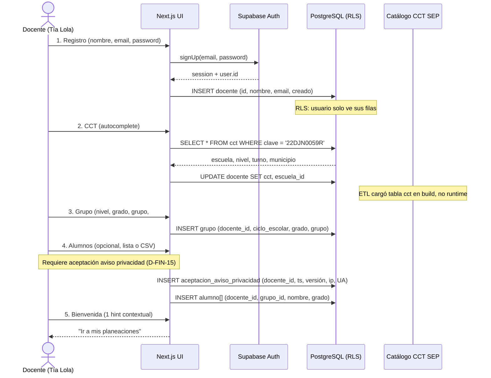
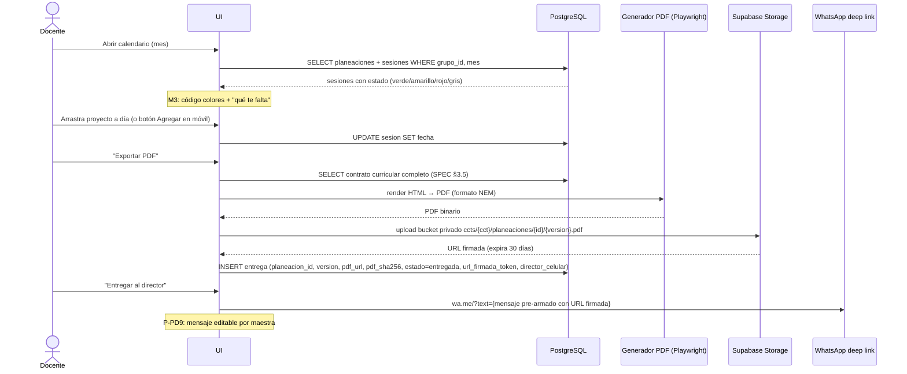
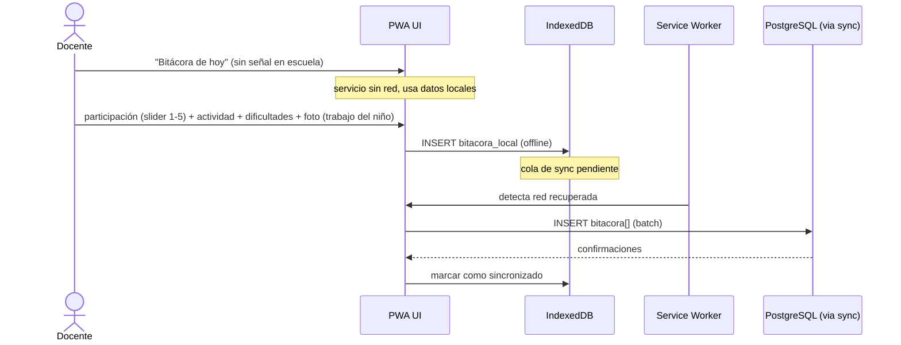
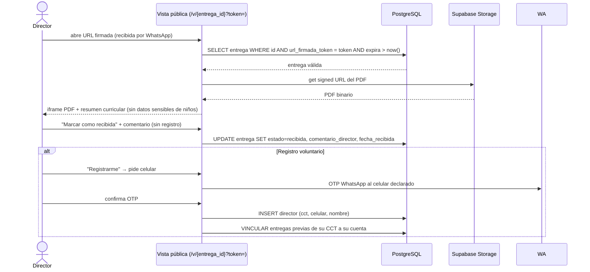
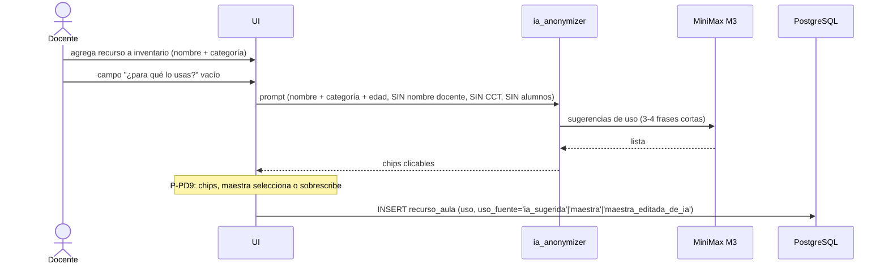
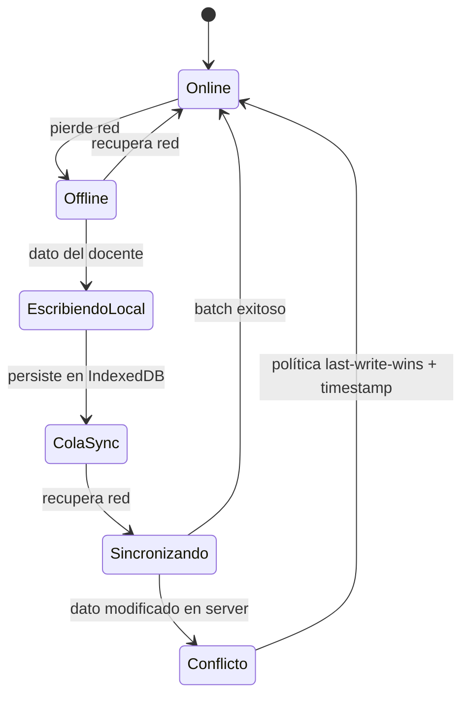
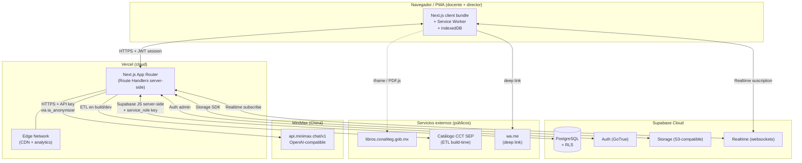
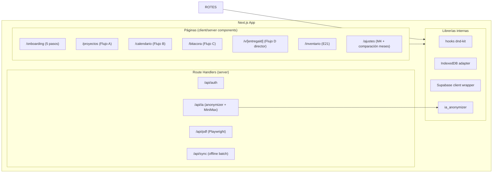

# SPEC TEC 01 — Arquitectura de la Plataforma NEM

**ID:** ARCH-NOCTURNO-2026-08-16-INTEGRA-A / SPEC-TEC-01
**Versión:** 1.0
**Fecha:** 2026-08-16
**Estado:** ESPECIFICACIÓN TÉCNICA — production-ready
**Autor:** INTEGRA (delegación nocturna ARCH-NOCTURNO-2026-08-16-INTEGRA-A)
**Audiencia:** SOFIA (implementación), GEMINI (auditoría), Frank (aprobación)

**Fuentes de verdad (precedencia §1):**
- `Educacion/fuentes/E22_CIERRE_DISCOVERY.md` — 19 decisiones D-FIN-1 a D-FIN-19
- `Educacion/fuentes/E20_PRINCIPIOS_DISENNO_PRODUCTO.md` — 9 principios P-PD1 a P-PD9
- `Educacion/fuentes/E21_CATALOGO_RECURSOS_AULA.md` — catálogo recursos aula + F-IA1
- `Educacion/SPEC_MVP_01_Modulo_Docente.md` — SPEC funcional v0.13
- `Educacion/fuentes/ENT-002_HALLAZGOS_PROYECTOS_REALES.md` — hallazgos H1-H6
- `Educacion/fuentes/ENT-003_DECISIONES_MVP.md` — decisiones D1-D4
- `Educacion/scripts/catalogar/outputs/catalogo_fase2_v2024_crudo.json` — catálogo NEM Fase 2

---

## 1. PROPÓSITO Y ALCANCE

Esta SPEC define la **arquitectura técnica** de la plataforma NEM: el sistema operativo del aula para docentes de educación preescolar mexicana (NEM — Nueva Escuela Mexicana). Documenta capas, servicios externos, flujos de datos end-to-end y decisiones arquitectónicas (ADRs) con justificación.

**Es autocontenida:** un ingeniero nuevo puede entender el sistema leyendo solo este documento + `SPEC_TEC_02_Modelo_Datos.md` + `SPEC_TEC_05_Infraestructura.md`.

**Alcance MVP (Fase 2 preescolar):**
- 1 modalidad pedagógica completa (Proyecto Comunitario).
- 1 rol principal (docente). Rol director cubierto con vista ligera (URL firmada).
- Catálogo NEM Fase 2: 24 PDA + 4 contenidos + 7 ejes + 4 campos formativos + 19 referencias CONALITEG.
- IA con 3 features (F1 variantes, F2 help-in-line, F3 pulido PDF). F4-F10 diferidas.

**No-objetivos (ver §11):** no es LMS, no es red social, no es marketplace, no reemplaza al docente, no aloja contenido CONALITEG (solo referencia con ficha).

---

## 2. CONTEXTO Y DECISIONES CONSOLIDADAS

El stack técnico está cerrado por el founder en E22 §4 (D-FIN-11 a D-FIN-14) y reforzado en SPEC_MVP §6. Las decisiones que esta arquitectura materializa:

| Decisión | Valor | Fuente |
|----------|-------|--------|
| Frontend | Next.js 14+ (App Router) + TypeScript strict + Tailwind + shadcn/ui | D-FIN-11 |
| Deploy frontend | Vercel (preview por PR) | D-FIN-11 |
| BD + Auth + Storage + Realtime | Supabase (PostgreSQL gestionado) | D-FIN-12 |
| Multi-tenant | RLS nativa por CCT (1 CCT = 1 escuela = N docentes) | D-FIN-12 |
| IA | MiniMax M3 vía conector OpenAI-compatible (cambiable por env var) | D-FIN-13 |
| Drag & drop | `@dnd-kit/core` + `@dnd-kit/sortable` (no react-dnd) | D-FIN-14 |
| Offline | PWA con service worker + IndexedDB | D-FIN-14 |
| Accesibilidad | WCAG 2.1 AA mínimo | SPEC §6.3 P-UX10 |
| PDF | Server-side (Playwright/Puppeteer) + URL firmada JWT | D-FIN-5 |
| Anonimizador IA | Módulo `ia_anonymizer` server-side, único camino a IA | SPEC §3.7.2 |
| Catálogo NEM | Versionado con SHA256 + auditoría de carga | catálogo JSON |

---

## 3. DIAGRAMA DE CAPAS

```mermaid
flowchart TB
    subgraph CLIENT["Capa Cliente (PWA)"]
        UI["UI React<br/>Next.js App Router<br/>Tailwind + shadcn/ui"]
        DND["Drag & drop<br/>@dnd-kit/core + sortable"]
        PWA["Service Worker<br/>cache assets críticos"]
        IDB["IndexedDB<br/>datos locales docente<br/>(bitácora, inventario, borradores)"]
        UI --> DND
        UI --> PWA
        UI --> IDB
    end

    subgraph EDGE["Capa Edge / API"]
        ROUTES["Next.js Route Handlers<br/>(server-side)"]
        MW["Middleware Auth<br/>verifica sesión Supabase"]
        ANON["ia_anonymizer<br/>úNICO camino a IA<br/>filtra PII antes de salir"]
        ROUTES --> MW
        ROUTES --> ANON
    end

    subgraph DATA["Capa Datos (Supabase)"]
        PG[("PostgreSQL<br/>gestionado<br/>+ RLS por CCT")]
        AUTH["Auth<br/>email + password<br/>+ magic link"]
        STORAGE["Storage<br/>PDFs CONALITEG cacheados<br/>fotos bitácora<br/>PDFs planeación"]
        RT["Realtime<br/>suscripción planeaciones<br/>director"]
        PG --- AUTH
        PG --- STORAGE
        PG --- RT
    end

    subgraph IA["Capa IA (externa)"]
        MM["MiniMax M3<br/>api.minimax.chat/v1<br/>OpenAI-compatible"]
        CACHE_IA["Cache de prompts<br/>30 días<br/>(mismo bloque + CCT-ofuscada)"]
        MM --- CACHE_IA
    end

    subgraph EXT["Servicios externos"]
        CONALITEG["Portal CONALITEG<br/>libros.conaliteg.gob.mx<br/>19 refs Fase 2"]
        SEP["Catálogo CCT SEP 2024<br/>CC-BY-4.0<br/>414 MB CSV"]
        WA["WhatsApp Web/App<br/>mensaje pre-armado director<br/>(deep link, sin API)"]
    end

    UI <-->|HTTPS + JWT| ROUTES
    ROUTES <-->|Supabase JS client<br/>server-side| PG
    ROUTES <-->|Supabase Auth| AUTH
    ROUTES <-->|Supabase Storage SDK| STORAGE
    ROUTES -->|suscripción| RT
    ANON -->|HTTPS + API key<br/>server-side| MM
    UI -.->|iframe / PDF.js| CONALITEG
    ROUTES -->|fetch ETL (build time)| SEP
    UI -->|deep link wa.me| WA
```

**Notas del diagrama:**
- La flecha `UI <--> ROUTES` es la única entrada del cliente al backend. No hay endpoints públicos exponiendo Supabase directamente al navegador sin RLS.
- `ia_anonymizer` es **obligatorio** entre Route Handlers y MiniMax. No existe ruta alternativa.
- WhatsApp se invoca como deep link (`https://wa.me/?text=...`) desde el cliente; no hay API de WhatsApp Business en MVP.

---

## 4. SERVICIOS EXTERNOS

### 4.1 Supabase (BD + Auth + Storage + Realtime)

**Rol:** servicio unificado de datos, autenticación, almacenamiento de archivos y suscripciones en tiempo real.

| Componente | Uso en NEM | Fuente |
|------------|------------|--------|
| PostgreSQL gestionado | Toda la persistencia relacional. RLS por CCT para multi-tenant. | D-FIN-12, SPEC §6.2 |
| Auth | Email + password + magic link. Sin OAuth social en MVP. Director via OTP WhatsApp (registro voluntario). | SPEC §6, M5 |
| Storage | Bucket privado para: fotos de bitácora (trabajo del niño), PDFs CONALITEG cacheados, PDFs de planeación generados. Path por CCT: `ccts/{cct}/...` | SPEC §6.2 |
| Realtime | Suscripción del director a nuevas entregas de su CCT. Suscripción del docente a cambios en sus planeaciones. | D-FIN-12 |

**Justificación frente a alternativa (Railway):** RLS nativo, menos servicios, menos superficie operacional. Trade-off: lock-in parcial, mitigado porque los datos salen como SQL estándar (PostgreSQL).

### 4.2 Vercel (hosting frontend)

**Rol:** hosting del frontend Next.js + edge functions donde aplique + preview deployments por PR.

| Aspecto | Valor |
|---------|-------|
| Framework target | Next.js 14+ App Router |
| Build | `next build` (output `.next/`) |
| Region |-default global edge;热leníar a región MX/US para latencia |
| Preview | un deployment por PR (rama) |
| Analytics | Vercel Analytics para Core Web Vitals (T-UX5) |
| Dominios | 1 dominio prod + subdominios preview |

### 4.3 MiniMax M3 (IA, vía OpenAI-compatible)

**Rol:** proveedor único de IA para features F1, F2, F3 (y F-IA1). Acceso vía conector compatible con OpenAI API.

| Aspecto | Valor |
|---------|-------|
| Modelo default | `minimax-m3` (cambiable por `AI_MODEL`) |
| Base URL default | `https://api.minimax.chat/v1` (cambiable por `AI_BASE_URL`) |
| Autenticación | API key en variable de entorno server-side (nunca en frontend) |
| Latencia objetivo | < 3s p95 por respuesta. Timeout 8s → degradación graceful. |
| Rate limit | 5 llamadas/min por usuario. Cola con mensaje "IA no disponible ahora". |
| Cache | prompts idénticos (mismo bloque + CCT-ofuscada) cachean 30 días. |
| Fallback | configurable a cualquier proveedor OpenAI-compatible (OpenAI, Anthropic, Together) vía env vars. Sin fallback automático en MVP: si cae, las features IA fallan graceful y el resto del producto sigue. | D-FIN-13, SPEC §3.7.3 |

**Política de datos hacia MiniMax (regla dura):** CERO datos de menores cruzan. `ia_anonymizer` aplica ofuscación de CCT, sustitución de nombres por token aleatorio de sesión, bloqueo de emails/celulares. Ver §6 (ADR-007).

### 4.4 Portal CONALITEG (referencia, no alojamiento)

**Rol:** fuente externa de libros oficiales SEP. La plataforma NO aloja contenido CONALITEG; solo referencia con ficha bibliográfica + URL.

| Estado de red | Mecanismo |
|---------------|-----------|
| Online | iframe directo al portal (`https://libros.conaliteg.gob.mx/2024/K{grado}{código}.htm`) |
| Offline | PDF.js con PDF cacheado localmente (IndexedDB, solo grado actual) |

**Atribución obligatoria:** "Libro distribuido por CONALITEG, SEP. © Gobierno de México" + link visible al portal oficial.

**19 referencias validadas** (catálogo JSON `referencias_conaliteg`): Mi Álbum (1°/2°/3°), Múltiples Lenguajes (1°/2°/3°), Láminas de diálogo (1°/2°/3°), Material manipulable (1°/2°/3°), Explorar e imaginar (1°/2°/3°), Crianza para la libertad, Un libro sin recetas, Modalidades de trabajo, Posibilidades de trabajo.

**Compliance:** distribución gratuita oficial. Atribución a CONALITEG/SEP obligatoria.

### 4.5 Catálogo CCT SEP 2024 (ETL en build)

**Rol:** dataset público CC-BY-4.0 (414 MB CSV) que mapea CCT → {estado, municipio, nivel, turno, sostenimiento}. No trae "zona rural/urbana/indígena" pero se deriva vía joins con INEGI AGEEML + CONAPO Metrópolis + INPI Pueblos Indígenas.

**Uso:** autocomplete en onboarding paso 2. ETL de 6-10 h-hombre materializado en tabla `cct` (ver SPEC_02). No se consulta en runtime desde SEP; se carga en build/dev y se sirve desde Supabase.

### 4.6 WhatsApp (deep link, sin API)

**Rol:** canal de entrega de planeación al director (D-FIN-19). No se usa WhatsApp Business API en MVP.

**Mecanismo:** la maestra hace clic en "Entregar al director" → se abre `https://wa.me/?text={mensaje pre-armado con URL firmada}` en WhatsApp Web/App. Mensaje editable por la maestra (P-PD9: la maestra decide). Director recibe link, abre sin registro.

**Anti-feature:** ❌ no enviamos WhatsApp/email automáticos al director en MVP. La maestra envía manualmente.

---

## 5. FLUJOS DE DATOS END-TO-END

### 5.1 Onboarding (5 pantallas) — captura única por ciclo



**Validaciones de arquitectura:**
- Aceptación de aviso de privacidad **obligatoria** antes de cualquier captura de nombres de alumnos (D-FIN-15).
- CCT siempre del catálogo (P-PD3). Si no está, captura manual con flag `pre-registro`.
- Datos del docente se piden una vez por ciclo (P-PD4).

### 5.2 Flujo A — Crear proyecto (con M1, M2, M4, IA F1)

```mermaid
sequenceDiagram
    actor D as Docente
    participant UI as UI (Route Handler)
    participant DB as PostgreSQL
    participant CAT as Catálogo NEM (tablas)
    participant ANON as ia_anonymizer
    participant MM as MiniMax M3

    D->>UI: Nuevo proyecto (modalidad: Proyecto Comunitario)
    UI->>DB: SELECT grupo activo del docente (RLS por CCT)
    D->>UI: 2. "Empezar por tu realidad" (M2)
    UI->>DB: SELECT situaciones típicas WHERE zona = docente.cct.zona
    D->>UI: elige situación (o escribe propia)
    D->>UI: 3. Cascada (campos, PDA, producto)
    UI->>DB: SELECT pda JOIN pda_por_campo_fase JOIN campo_formativo
    DB-->>UI: 24 PDA Fase 2 con contenido oficial
    Note over UI: sugiere 2-3 PDA probables; TODO editable
    D->>UI: confirma campos + PDA + producto + ejes
    UI->>DB: INSERT planeacion (docente_id, grupo_id, nombre, problema_contexto, proposito, campos[], ejes[], pdas[], contenido_ref, producto_integrador)

    D->>UI: 4. Banco de bloques M1 (filtrado por M4)
    UI->>DB: SELECT bloque WHERE caracteristica_requerida ⊆ docente.escuela.config
    DB-->>UI: bloques compatibles + alternativos + no-aplica

    D->>UI: 5. Arrastra bloque (variantes IA F1)
    UI->>ANON: ofusca CCT → CCT-**[REDACTED]**-zona-{estado}/{municipio}
    ANON->>MM: prompt (bloque + zona + características M4, SIN PII)
    MM-->>ANON: variante local del contenido
    ANON-->>UI: 1 variante (maestra acepta o descarta)
    Note over UI: P-PD9: IA sugiere, maestra decide. Nunca autocompleta.

    D->>UI: 6. Guarda proyecto
    UI->>DB: INSERT sesion[] + bloque[] (heredan PDA del catálogo)
```

### 5.3 Flujo B — Calendarizar + exportar PDF + entregar



### 5.4 Flujo C — Bitácora offline (celular)



**Política de fotos (regla dura):** la foto solo puede ser del **trabajo del niño** (productos, dibujos, manipulables). La app muestra mensaje explícito "La foto es del trabajo del niño, no del niño". Reforma Senado 26-dic-2025.

### 5.5 Flujo D — Director revisa (URL firmada, sin registro)



**Prueba cruzada de identidad (M5):** la OTP llega al celular que la maestra usó para entregar. Si es otro celular, la OTP no llega y no puede registrarse.

### 5.6 F-IA1 — Auto-sugerido de uso de recurso (E21 §3.3.1)



**Reglas anti-alucinación:** si MiniMax no sabe, devuelve lista vacía (no inventa). Las sugerencias son referencia, no verdad. El sistema **NUNCA** autocompleta sin que la maestra vea la sugerencia.

**Cache:** mismo par (nombre, categoría) → misma respuesta cacheada 30 días. El kit preescolar genérico (30 items) se cachea 1 vez.

### 5.7 Sincronización offline → online



**Política de conflictos (MVP):** last-write-wins con timestamp del cliente. La bitácora y el inventario son del docente individual (no hay concurrencia cross-usuario sobre la misma fila). Si una planeación se editó en server mientras el docente estaba offline, se ofrece al docente elegir versión.

---

## 6. DECISIONES ARQUITECTÓNICAS (ADRs)

Formato corto: contexto → decisión → justificación → consecuencias.

### ADR-001 — Next.js + Vercel para frontend

**Contexto:** MVP responsive (móvil + laptop) con drag-and-drop maduro, PWA, SSR para SEO/velocidad, preview deployments por PR.

**Decisión:** Next.js 14+ con App Router, TypeScript strict, Tailwind CSS + shadcn/ui. Deploy en Vercel.

**Justificación:** ecosistema React maduro, `@dnd-kit` es la librería accesible de referencia, Vercel da preview por PR sin configuración, App Router permite Route Handlers server-side para llamadas a MiniMax (API key nunca en cliente). Tailwind + shadcn = velocidad + accesibilidad WCAG (P-UX10).

**Consecuencias:**
- (+) Velocidad de desarrollo, accesibilidad from scratch, edge functions donde aplique.
- (-) Lock-in parcial con Vercel (mitigado: Next.js es portable).
- (-) App Router aún evoluciona; vigilar breaking changes.

**Fuente:** D-FIN-11, SPEC §6.

---

### ADR-002 — Supabase como servicio unificado con RLS por CCT

**Contexto:** multi-tenant (1 CCT = 1 escuela = N docentes). Necesitamos BD + Auth + Storage + Realtime con aislamiento por CCT.

**Decisión:** Supabase (PostgreSQL gestionado) con **Row-Level Security nativa** por CCT en cada tabla. Una sola base de datos, un solo schema, aislamiento lógico vía RLS policies.

**Justificación:** RLS nativo de PostgreSQL es maduro y auditable. Evita el coste operacional de N schemas o N bases de datos. Auth + Storage + Realtime en un solo servicio reduce superficie operacional. Los datos salen como SQL estándar (mitigación de lock-in).

**Consecuencias:**
- (+) Aislamiento auditable, un solo servicio, SQL portable.
- (-) Lock-in parcial con Supabase (mitigado: PostgreSQL estándar).
- (-) RLS policies requieren disciplina: cada tabla lleva `cct` o `escuela_id` y policy explícita. Un test E2E debe verificar que CCT-A no ve entregas de CCT-B (ver SPEC §6.2).
- (-) Performance: RLS agrega filtro por fila. Vigilar queries hot (ver índices SPEC_02).

**Alternativa descartada:** Railway (PostgreSQL sin RLS nativo + Auth separado). Requiere más servicios, más configuración.

**Fuente:** D-FIN-12, SPEC §6.2.

---

### ADR-003 — MiniMax M3 vía conector OpenAI-compatible

**Contexto:** IA para F1 (variantes bloques), F2 (help-in-line), F3 (pulido PDF), F-IA1 (uso de recursos). Proveedor único, sin fallback automático. Compliance LFPDPPP 2025 (transferencia internacional).

**Decisión:** MiniMax M3 como proveedor default, accesible vía un conector compatible con OpenAI API. URL, modelo y API key en variables de entorno server-side (`AI_PROVIDER`, `AI_BASE_URL`, `AI_MODEL`, `AI_API_KEY`). Sin hardcodear URLs ni modelos en código.

**Justificación:** abstracción OpenAI-compatible permite cambiar de proveedor (OpenAI, Anthropic, Together, etc.) sin reescribir código, solo cambiando env vars. MiniMax elegido por preferencia del founder. Degradación graceful: si MiniMax cae, las features IA muestran "IA no disponible ahora" y el resto del producto sigue (catálogo, calendario, entrega, portal director).

**Consecuencias:**
- (+) Flexibilidad de proveedor, degradación graceful.
- (-) Transferencia internacional de datos (LFPDPPP art. 36-38). Mitigado por ADR-007 (anonymizer) + aviso de privacidad explícito para IA.
- (-) Sin fallback automático en MVP: si MiniMax cae, las features IA fallan. Aceptado.
- (-) Latencia variable. Mitigado por cache 30 días y timeout 8s.

**Fuente:** D-FIN-13, SPEC §3.7.3.

---

### ADR-004 — @dnd-kit + PWA offline-first

**Contexto:** drag-and-drop accesible en móvil (donde es impreciso), PWA offline-first para bitácora e inventario (escuela sin señal).

**Decisión:** `@dnd-kit/core` + `@dnd-kit/sortable` (no react-dnd legacy). PWA con service worker para cache de assets críticos + IndexedDB para datos locales del docente.

**Justificación:** `@dnd-kit` es la librería accesible de referencia (WCAG 2.1 AA), soporta teclado y touch. `react-dnd` es legacy con problemas de accesibilidad. PWA + IndexedDB resuelve el escenario "Tía Lola planea de noche sin señal" (Flujo C bitácora offline).

**Consecuencias:**
- (+) Accesibilidad from scratch, offline real para bitácora.
- (-) Drag en móvil impreciso (30-40% fallo documentado). Mitigado: botón "Agregar al día" como acción primaria en móvil, drag como secundario; haptic feedback (`navigator.vibrate(20)`); undo button visible 2 semanas.
- (-) `touch-action: none` debe ir inline (issue Tailwind Feb 2025).
- (-) Sincronización offline → online no trivial (ver §5.7 política conflictos).

**Fuente:** D-FIN-14, SPEC §6.1.

---

### ADR-005 — Multi-tenant por CCT vía RLS (no por schema separado)

**Contexto:** cada escuela es un tenant lógico. Datos aislados por CCT.

**Decisión:** una sola base de datos, un solo schema. Aislamiento lógico vía columna `cct` (o `escuela_id`) + RLS policies en cada tabla. Path de Storage por CCT: `ccts/{cct}/...`.

**Justencia:** N schemas (uno por escuela) es inviable a escala (cientos de miles de CCTs). RLS es el patrón estándar de multi-tenant en PostgreSQL y Supabase lo soporta nativamente.

**Consecuencias:**
- (+) Escala lineal, un solo schema para mantener.
- (-) RLS policies son superficies de seguridad: un bug en una policy = fuga cross-tenant. Requiere test E2E de aislamiento (SPEC §6.2).
- (-) Migraciones de schema afectan a todos los tenants a la vez.

**Casos borde:**
- Maestra con CCT pero sin director asignado: la app funciona; sus entregas se guardan sin destino hasta que el director se registre.
- Director de CCT con varios maestros: panel director muestra TODOS los maestros vinculados a su CCT.
- Cambio de CCT del maestro (traslado): requiere acción explícita de desvinculación; no automático.

**Fuente:** SPEC §6.2.

---

### ADR-006 — PDF server-side + URL firmada JWT

**Contexto:** PDF triple (visualizable + descargable + compartible, D-FIN-5). Director abre sin registro. Formato NEM reconocible (SPEC §3.5).

**Decisión:** generación PDF server-side con Playwright o Puppeteer (render HTML → PDF). URL firmada con JWT, expiración configurable (default 30 días). PDF almacenado en Supabase Storage privado, path `ccts/{cct}/planeaciones/{id}/{version}.pdf`. Hash SHA256 del PDF almacenado en la entrega para integridad.

**Justificación:** Playwright/Puppeteer permite reutilizar componentes React para el layout del PDF. URL firmada permite al director abrir sin registro (M5). SHA256 permite verificar que el PDF no fue alterado post-entrega.

**Consecuencias:**
- (+) PDF con formato NEM reconocible, director sin registro, integridad verificable.
- (-) Generación PDF es costosa (playwright headless). Mitigado: cache por versión, generar solo en click "Exportar".
- (-) URLs firmadas expiran. Default 30 días configurable. Si expira, la maestra regenera.
- (-) Cada edición post-entrega genera nueva versión (v2, v3...). El PDF anterior se preserva.

**Fuente:** D-FIN-5, SPEC §3.6.M5, ENT-003 D3.

---

### ADR-007 — ia_anonymizer server-side como único camino a IA

**Contexto:** LFPDPPP 2025 + reforma Senado 26-dic-2025. Regla dura: CERO datos de menores cruzan a MiniMax. CCT completa se ofusca. Nombres/celulares/emails no salen.

**Decisión:** módulo `ia_anonymizer` (server-side, en Route Handlers) es el **único** camino para llamar a MiniMax. Aplica reglas de ofuscación a TODO prompt antes de salir del backend. Tests unitarios verifican que ningún PII cruza. Auditoría mensual de logs.

**Reglas de ofuscación (tabla de políticas):**

| Tipo de dato | Permitido a MiniMax | Bloqueado |
|--------------|---------------------|-----------|
| Texto pedagógico (contenido de bloque, apertura, cierre) | Sí | |
| CCT completa (10 dígitos) | | NO. Se ofusca a `CCT-**[REDACTED]**-zona-{estado}/{municipio}` |
| CCT-zona categorizada (urbana/rural/indígena) | Sí (categórica, no identifica persona) | |
| Grado, fase NEM, características M4 | Sí | |
| Nombre del docente | | NO. Sustituir por token aleatorio de sesión |
| Email / celular del docente | | NO. Nunca sale del backend |
| Email / celular del director | | NO. Nunca sale del backend |
| Datos de alumnos (nombres, notas, observaciones) | | **REGLA DURA: NO bajo ninguna circunstancia**. Filter a nivel de código antes de cualquier llamada |
| Fotos de bitácora | | NO. No se envía como contexto |
| Comentarios del director | | NO. Privacidad del director |

**Consecuencias:**
- (+) Compliance LFPDPPP auditable, regla dura enforceable en código.
- (-) Overhead de una capa. Mitigado: cache reduce llamadas.
- (-) Un bug en anonymizer = fuga. Mitigado: tests unitarios + auditoría mensual.

**Fuente:** SPEC §3.7.2.

---

### ADR-008 — IndexedDB + Service Worker para offline-first

**Contexto:** Tía Lola planea de noche sin señal. Bitácora se llena en escuela sin internet. Inventario del aula se edita offline.

**Decisión:** IndexedDB para datos locales del docente (bitácora pendiente, inventario, borradores de planeación). Service Worker para cache de assets críticos (HTML, CSS, JS, iconos Lucide). Sincronización cuando haya red (Supabase Realtime o polling).

**Consecuencias:**
- (+) Bitácora funciona sin red.
- (-) Complejidad de sync. Mitigado: last-write-wins + timestamp (ver §5.7).
- (-) Storage limitado. Mitigado: solo datos del docente actual, no catálogo completo.
- (-) PDFs CONALITEG cacheados: solo grado actual (no 19 libros × 50MB = 950MB).

**Fuente:** D-FIN-14, SPEC §6.

---

### ADR-009 — Catálogo NEM versionado con SHA256 + auditoría de carga

**Contexto:** el catálogo NEM es fuente de verdad pedagógica (P-PD2). PDA nunca inventados por IA ni por la maestra. Cambios en DOF actualizan catálogo (E10/E11).

**Decisión:** tabla `catalogo_version` registra cada carga del catálogo con: código, nombre, fecha_vigencia, fuente_dof, fuente_sha256 (hash del PDF/DOF origen), fecha_carga, cargado_por. Tabla `auditoria_carga` registra cada acción (agregado, modificación, eliminación) con observación y autor. Los PDA/contenidos referencian `fuente_dof_pagina` + `fuente_dof_sha` para trazabilidad al DOF.

**Justificación:** el catálogo NEM es la base de la alineación pedagógica verificable. Sin versionado + auditoría, no hay defensa ante una auditoría regulatoria o pedagógica. El SHA256 del PDF fuente permite verificar que un PDA proviene del DOF oficial.

**Consecuencias:**
- (+) Trazabilidad pedagógica end-to-end, defensa ante auditoría.
- (-) Overhead de metadatos en cada PDA/contenido. Aceptado (es el costo de la alineación).
- (-) Actualización del catálogo requiere re-cargar con nuevo SHA. Proceso documentado en E10.

**Fuente:** catálogo JSON `metadata_extraccion` + `catalogo_version` + `auditoria_carga`.

---

### ADR-010 — Portal CONALITEG con estrategia híbrida online/offline

**Contexto:** 19 referencias CONALITEG con URLs específicas validadas. La plataforma NO aloja contenido (solo referencia). Escuelas sin internet necesitan acceso offline.

**Decisión:** estrategia híbrida:
- **Online:** iframe directo al portal CONALITEG (`https://libros.conaliteg.gob.mx/2024/K{grado}{código}.htm`).
- **Offline:** PDF.js con PDF cacheado localmente (IndexedDB). Solo libros del grado actual (no 19 × 50MB).
- **Atribución obligatoria:** "Libro distribuido por CONALITEG, SEP. © Gobierno de México" + link visible al portal oficial.

**Justificación:** cumplimiento de distribución gratuita oficial + resiliencia offline.

**Consecuencias:**
- (+) Acceso offline, atribución compliance.
- (-) Dependencia del portal CONALITEG para online. Si cae, fallback a PDF cacheado.
- (-) Descarga inicial de PDFs del grado (50MB aprox). Mitigado: prompt en onboarding "¿descargar libros para uso sin internet?".

**Fuente:** D-FIN-10, catálogo JSON `referencias_conaliteg`.

---

### ADR-011 — Entrada por CCT (no GPS) para multi-tenant + contexto

**Contexto:** M2 (problema del contexto primero) necesita contextualizar por zona. Multi-tenant necesita clave de escuela. LFPDPPP: GPS es dato sensible.

**Decisión:** la maestra entra por **CCT (Clave de Centro de Trabajo, 10 dígitos SEP)**, no por GPS. El CCT es dato público SEP (no es dato personal aislado). El CCT identifica estado + municipio + nivel + turno automáticamente. La zona rural/urbana/indígena se deriva vía joins (INEGI + CONAPO + INPI) en ETL de build, no en runtime.

**Justificación:** CCT es la verdad administrativa (la maestra puede vivir lejos y dar clases en zona distinta). GPS sería dato personal sensible innecesario. CCT + catálogo SEP 2024 da contexto suficiente.

**Consecuencias:**
- (+) No GPS, compliance LFPDPPP, contexto administrativo confiable.
- (-) El CCT combinado con nombre + celular + email SÍ forma conjunto de datos personales (LFPDPPP 2025 art. 3 fr. XIV). Requiere base legal explícita (consentimiento art. 8 o excepción art. 10). Documentado en aviso de privacidad (E4).
- (-) Si CCT no está en catálogo: maestra lo agrega manualmente (pre-registro individual, T25).

**Fuente:** SPEC §3.6.M2, E15.

---

### ADR-012 — Degradación graceful si IA no disponible

**Contexto:** MiniMax es proveedor único sin fallback automático. Si cae, las features IA deben fallar sin romper el producto.

**Decisión:** las features F1, F2, F3 y F-IA1 muestran "IA no disponible ahora, hazlo manual" y el flujo continúa sin IA. El catálogo, calendario, entrega y portal director NO dependen de IA.

**Justificación:** la IA es adaptador (P-PD8), no inventor. El producto da valor sin IA. La maestra es autora; la IA es asistente opcional.

**Consecuencias:**
- (+) Resiliencia, la IA no es punto único de fallo del producto.
- (-) Si MiniMax cae frecuentemente, la experiencia degrada. Mitigado: cache 30 días + monitor de costos/disponibilidad (R-IA1, R-IA4).

**Fuente:** SPEC §3.7.5, §3.7.6 R-IA1.

---

## 7. DIAGRAMA DE DESPLIEGUE



**Límites de confianza:**
- `APP ↔ NEXT`: única entrada del cliente. JWT de sesión Supabase.
- `NEXT ↔ PG`: service_role key server-side, pero RLS sigue aplicando (defensa en profundidad).
- `NEXT → API`: solo vía `ia_anonymizer`. API key server-side, nunca en bundle cliente.
- `APP -.-> CONAL`: iframe/PDF.js, sin credenciales.

---

## 8. DIAGRAMA DE COMPONENTES (capa frontend)



---

## 9. TRAZABILIDAD DE PRINCIPIOS

Esta arquitectura **cumple** los principios producto (E20) y UX (SPEC §6.3):

| Principio | Cómo se cumple en arquitectura |
|-----------|--------------------------------|
| P-PD1 (85/15 selección sobre escritura) | Catálogo NEM + bloques M1 arrastrables + inventario E21. La IA sugiere (chips), no escribe. |
| P-PD2 (catálogo curado como fuente de verdad) | ADR-009: catálogo versionado con SHA256. PDA nunca inventados por IA. |
| P-PD3 (datos del mundo vienen del mundo) | ADR-011: CCT del catálogo SEP. CONALITEG referenciado, no alojado. |
| P-PD4 (datos del docente una vez) | Onboarding 5 pantallas, datos heredados por ciclo. |
| P-PD5 (wizard adaptativo por modalidad) | Estructura de plantilla por modalidad en tabla `planeacion.modalidad`. MVP: Proyecto Comunitario. |
| P-PD6 (rúbrica 4 niveles semáforo) | `evaluacion_alumno.nivel` CHECK (1-4). Paleta verde/amarillo/naranja/rojo. |
| P-PD7 (PDF triple) | ADR-006: URL firmada + descarga + WhatsApp. |
| P-PD8 (IA adaptador, no inventor) | ADR-003 + ADR-007: MiniMax solo adapta texto del catálogo. Anonymizer enforce. |
| P-PD9 (IA solo sugiere, maestra decide) | F1/F2/F3/F-IA1 muestran chips. Metadata `uso_fuente`/`origen` en cada campo. |
| P-UX1 (una pregunta por pantalla) | Onboarding 5 pantallas, 1 campo por pantalla. |
| P-UX4 (mobile-first honest) | dnd-kit + botón "Agregar" en móvil (ADR-004). Test 360×640. |
| P-UX10 (WCAG 2.1 AA) | @dnd-kit accesible, shadcn/ui, Lucide. |

---

## 10. DECISIONES PENDIENTES (requieren aprobación de Frank)

| ID | Decisión | Opciones | Impacto |
|----|----------|----------|---------|
| DP-01 | **Hosting del generador PDF** | (a) Playwright en Vercel (serverless, límite 10s en plan hobby) · (b) Vercel + función dedicada · (c) Microservicio separado (Railway/Fly) | Si el PDF NEM tarda >10s en generarse, (a) falla. Validar con PDF real (80 páginas) antes de cerrar. |
| DP-02 | **Región de la base de datos Supabase** | (a) us-east-1 (latencia baja desde MX vía Vercel edge) · (b) sa-east-1 (São Paulo, datos en Latinoamérica) | (b) mejor compliance de "datos en la región" pero latencia ligeramente mayor. Revisar requisito LFPDPPP de localización. |
| DP-03 | **OTP WhatsApp: proveedor** | (a) WhatsApp Business API oficial (Meta) con socio BSP · (b) Servicio third-party (Twilio, MessageBird) · (c) Solo deep link `wa.me` sin OTP automatizado en MVP | (c) ya cubre entrega (D-FIN-19) pero NO cubre OTP de registro del director (M5). Para M5 completo se necesita (a) o (b). Coste estimado T27: cubierto hasta 1000 envíos/mes. |
| DP-04 | **Cache de prompts IA: dónde** | (a) Tabla `ia_cache` en Supabase · (b) Redis (Upstash) · (c) Vercel KV | (a) simplest, sin servicio extra. (b)/(c) más rápido pero añade servicio. MVP: recomiendo (a). |
| DP-05 | **Monitoreo de errores: Sentry vs Vercel nativo** | (a) Sentry (gratuito hasta 5k errores/mes) · (b) Vercel Analytics + logs nativos | (a) más rico en SDK + source maps. (b) menos configuración. Recomiendo (a) para MVP. |
| DP-06 | **Backup automático Supabase** | (a) Plan Pro Supabase (backups diarios, $25/mes) · (b) Export JSON manual (D-FIN-18 diferido) + pg_dump cron | E22 D-FIN-18 diferió el backup automático a Fase 2. Para piloto con Tía Lola, (b) es aceptable. Para >10 docentes, migrar a (a). |
| DP-07 | **Dominio principal** | (a) `nem.app` (o similar) · (b) subdominio de un dominio existente de Frank | Necesario para Vercel prod + Supabase URL config. Definir antes del piloto. |
| DP-08 | **Categoría `pda_ejes` vacía en catálogo JSON** | El catálogo JSON tiene `pda_ejes: []` (0 relaciones PDA-eje). E22 §5 menciona "7 ejes". Decidir: (a) los PDA Fase 2 no tienen ejes articuladores asociados oficialmente (dejar vacío) · (b) curar asociaciones PDA-eje manualmente | Impacta el modelo de datos: si (a), la tabla `pda_ejes` queda vacía pero existe. Si (b), requiere curaduría humana (tesis de founder). Recomiendo (a) para MVP y documentar. |

---

## 11. NO-OBJETIVOS (anti-features arquitectónicas)

- ❌ **No es LMS.** No gestiona inscripciones, calificaciones sumativas, ni reportes a coordinación.
- ❌ **No es red social docente.** Sin perfiles públicos, sin feed, sin mensajería entre docentes.
- ❌ **No es marketplace.** Sin bloques de pago, sin planes freemium en MVP.
- ❌ **No reemplaza al docente.** La IA sugiere; la maestra decide (P-PD9).
- ❌ **No aloja contenido CONALITEG.** Solo referencia con ficha + URL (ADR-010).
- ❌ **No usa GPS.** Entrada por CCT (ADR-011).
- ❌ **No hace evaluación del alumno por IA.** CERO datos de menores cruzan a MiniMax (regla dura, ADR-007).
- ❌ **No genera reportes a supervisión automatizados.** Diferido a Fase 2.
- ❌ **No tiene memoria entre sesiones de IA.** Cada llamada es stateless.
- ❌ **No se entrena con datos del producto.** MiniMax es modelo congelado, sin fine-tuning.
- ❌ **No envía WhatsApp/email automáticos al director en MVP.** La maestra envía manualmente.

---

## 12. RIESGOS ARQUITECTÓNICOS

| ID | Riesgo | Probabilidad | Impacto | Mitigación |
|----|--------|--------------|---------|-----------|
| RA-01 | RLS policy con bug = fuga cross-tenant | Media | Crítico | Test E2E de aislamiento CCT-A vs CCT-B. Review obligatorio de cada policy. |
| RA-02 | MiniMax inaccesible geográficamente | Media | Medio | ADR-012 degradación graceful. Plan de migración a modelo local open-source (Fase 2). |
| RA-03 | Costo IA se dispara | Baja | Medio | Rate limit 5/min/usuario + cache 30 días + monitor de costos (R-IA4). |
| RA-04 | Fuga de PII por error de prompt | Baja | Crítico | ADR-007 anonymizer único camino + tests unitarios + auditoría mensual. |
| RA-05 | PDF >10s en Vercel serverless | Media | Medio | DP-01: validar con PDF real antes de cerrar. Fallback: función dedicada. |
| RA-06 | Sync offline conflictos | Media | Bajo | Política last-write-wins + timestamp (§5.7). Datos del docente individual = baja concurrencia. |
| RA-07 | Catálogo NEM desactualizado (DOF cambia) | Baja | Medio | ADR-009 versionado + E10/E11 monitor de vigilancia normativa. |
| RA-08 | Drag móvil impreciso | Alta | Bajo | ADR-004 botón "Agregar" primario + haptic + undo. |
| RA-09 | Compliance LFPDPPP transferencia internacional IA | Media | Alto | ADR-007 + aviso de privacidad explícito + consentimiento expreso (art. 8) o excepción (art. 37). |
| RA-10 | Fase 1 (0-3 años) sin programa sintético oficial | Baja | Bajo | Etiquetar como "extensión no oficial" si se incluye. MVP foco Fase 2. |

---

## 13. GLOSARIO

| Término | Definición |
|---------|------------|
| **NEM** | Nueva Escuela Mexicana. Plan de estudios 2022 vigente. |
| **CCT** | Clave de Centro de Trabajo (10 dígitos SEP). Identifica una escuela. |
| **PDA** | Proceso de Desarrollo de Aprendizaje. Descripción oficial del DOF de lo que se espera que logre el niño. |
| **CONALITEG** | Comisión Nacional de Libros de Texto Gratuitos. Editora de los libros oficiales SEP. |
| **DOF** | Diario Oficial de la Federación. Fuente normativa. |
| **LFPDPPP** | Ley Federal de Protección de Datos Personales en Posesión de los Sujetos Obligados (2025). |
| **RLS** | Row-Level Security. Mecanismo de PostgreSQL para filtrar filas por usuario. |
| **M1-M5** | Mejoras de diseño del SPEC: M1 bloques, M2 contexto, M3 calendario, M4 características escuela, M5 entrega director. |
| **F1-F4** | Features IA: F1 variantes, F2 help-in-line, F3 pulido PDF, F4 resumen narrativo (diferido). |
| **F-IA1** | Auto-sugerido de uso de recurso por IA (E21 §3.3.1). |
| **P-PD1 a P-PD9** | Principios de diseño de producto (E20). |
| **P-UX1 a P-UX10** | Principios UX innegociables (SPEC §6.3). |
| **D-FIN-1 a D-FIN-19** | Decisiones formalizadas en E22. |
| **Kit preescolar genérico** | Plantilla de 30 items en 6 categorías pedagógicas para inventario del aula (E21). |

---

## 14. RELACIÓN CON OTROS DOCUMENTOS

| Documento | Relación |
|-----------|----------|
| `SPEC_TEC_02_Modelo_Datos.md` | Implementa ADR-002, ADR-005, ADR-009 con DDL SQL + RLS. |
| `SPEC_TEC_05_Infraestructura.md` | Implementa ADR-001, ADR-002 con config Supabase/Vercel/env vars/CI-CD. |
| `SPEC_MVP_01_Modulo_Docente.md` | SPEC funcional fuente. Esta SPEC la materializa técnicamente. |
| `fuentes/E22_CIERRE_DISCOVERY.md` | Fuente de las 19 decisiones. |
| `fuentes/E20_PRINCIPIOS_DISENNO_PRODUCTO.md` | Fuente de los 9 principios. |
| `fuentes/E21_CATALOGO_RECURSOS_AULA.md` | Fuente del catálogo recursos aula + F-IA1. |
| `scripts/catalogar/outputs/catalogo_fase2_v2024_crudo.json` | Fuente del catálogo NEM real (24 PDA, 4 contenidos, 19 refs). |

---

## 15. CRITERIOS DE ACEPTACIÓN DE ESTA SPEC

- [x] Diagrama de capas con las 5 capas (cliente, edge/API, datos, IA, externos).
- [x] Servicios externos documentados (Supabase, Vercel, MiniMax, CONALITEG, SEP, WhatsApp).
- [x] Flujos E2E con Mermaid (onboarding, Flujo A, B, C, D, F-IA1, sync offline).
- [x] 12 ADRs con contexto/decisión/justificación/consecuencias.
- [x] Diagrama de despliegue + componentes.
- [x] Trazabilidad de principios (P-PD, P-UX).
- [x] Decisiones pendientes explícitas (DP-01 a DP-08) con opciones.
- [x] No-objetivos y riesgos documentados.
- [x] Autocontenida (glosario + relaciones).

---

**Fin de SPEC TEC 01.**
