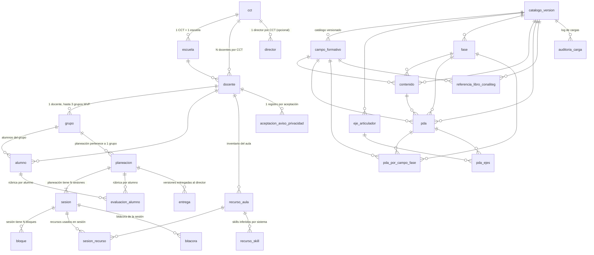

# SPEC TEC 02 — Modelo de Datos NEM

**ID:** ARCH-NOCTURNO-2026-08-16-INTEGRA-A / SPEC-TEC-02
**Versión:** 1.0
**Fecha:** 2026-08-16
**Estado:** ESPECIFICACIÓN TÉCNICA — production-ready
**Autor:** INTEGRA (delegación nocturna ARCH-NOCTURNO-2026-08-16-INTEGRA-A)
**Audiencia:** SOFIA (implementación de migraciones), GEMINI (auditoría), Frank (aprobación)

**Fuentes de verdad:**
- `Educacion/SPEC_MVP_01_Modulo_Docente.md` §4 (entidades) + §3.6.M5 (entrega)
- `Educacion/fuentes/E22_CIERRE_DISCOVERY.md` D-FIN-2, D-FIN-15, D-FIN-16, D-FIN-17
- `Educacion/fuentes/E21_CATALOGO_RECURSOS_AULA.md` §5 (recurso_aula, sesion_recurso, recurso_skill)
- `Educacion/scripts/catalogar/outputs/catalogo_fase2_v2024_crudo.json` (catálogo NEM real: 24 PDA, 4 contenidos, 7 ejes, 4 campos, 6 fases, 19 refs CONALITEG)
- `SPEC_TEC_01_Arquitectura.md` ADR-002 (RLS por CCT), ADR-005 (multi-tenant), ADR-009 (catálogo versionado)

---

## 1. PROPÓSITO Y ALCANCE

Esta SPEC define el **modelo de datos relacional** completo de la plataforma NEM: DDL SQL ejecutable directamente en PostgreSQL/Supabase, Row-Level Security por CCT (multi-tenant), índices, constraints, triggers y datos seed del catálogo NEM Fase 2.

**Es ejecutable:** el SQL de este documento, copiado en orden en el SQL editor de Supabase (o `psql`), crea el schema completo y carga el catálogo NEM Fase 2.

**Es autocontenida:** un DBA nuevo puede desplegar el modelo leyendo solo este documento.

---

## 2. CONVENCIONES DE NOMENCLATURA

| Convención | Regla |
|------------|-------|
| Nombres de tabla | `snake_case`, singular (ej. `docente`, `planeacion`). |
| Nombres de columna | `snake_case`. |
| Claves primarias (producto) | `id uuid default gen_random_uuid()`. Evita exponer contadores. |
| Claves primarias (catálogo) | código textual corto (ej. `codigo text primary key`). Estable, legible, inmutable. |
| Claves foráneas | `{tabla_singular}_id` o nombre semántico. |
| Timestamps | `timestamptz`, `created_at` default `now()`, `updated_at` default `now()` actualizado por trigger. |
| Soft delete | `activo boolean default true`. El borrado físico solo vía script de retención. |
| Multi-tenant | cada tabla tenant lleva `cct text not null references cct(clave)` para RLS directa. |
| Charset/collation | UTF-8, collation por defecto del cluster. |
| Esquema | `public` (default Supabase). No se usan schemas separados por tenant (ADR-005). |

---

## 3. EXTENSIONES REQUERIDAS

```sql
-- Requeridas en Supabase (activadas por defecto). Verificar.
create extension if not exists pgcrypto;        -- gen_random_uuid()
create extension if not exists "pg_stat_statements";  -- monitoreo queries (opcional)
-- auth.users y auth.uid() provistos por Supabase Auth (GoTrue).
```

`pgcrypto` es obligatorio para `gen_random_uuid()`. `auth.uid()` es función del esquema `auth` de Supabase (devuelve el UUID del usuario autenticado).

---

## 4. DIAGRAMA ER (relaciones principales)



**Nota:** Mermaid ER tiene límites de densidad. El diagrama muestra relaciones principales. El DDL de §5 es la fuente de verdad de las FKs.

---

## 5. DDL SQL COMPLETO

El SQL está organizado en 3 grupos lógicos. **Ejecutar en orden.**

### 5.1 Grupo A — Tablas de catálogo NEM (público, lectura, versionado, SIN RLS)

Estas tablas son **compartidas** por todos los tenants. Contienen el catálogo oficial NEM (PDA, contenidos, ejes, campos, fases, referencias CONALITEG). No llevan `cct` ni RLS. Son de **solo lectura** desde la aplicación (los writes son por proceso de carga del catálogo, ver ADR-009).

#### 5.1.1 `catalogo_version` — versionado del catálogo con SHA256

```sql
create table if not exists catalogo_version (
    codigo              text primary key,              -- 'PLAN_2022_ED_2025_FASE_2'
    nombre              text not null,                  -- 'Plan de Estudio 2022 — Fase 2 (Preescolar)'
    fecha_vigencia      date not null,                  -- '2025-08-01'
    fuente_dof          text not null,                  -- 'Acuerdo 14/08/22 + Anexo 06/08/23'
    fuente_sha256       text not null,                  -- hash del PDF/DOF origen (trazabilidad)
    fecha_carga        timestamptz not null default now(),
    cargado_por         text not null,                  -- 'SOFIA + IMPL-20260816-02' (agente + ID intervención)
    metadata            jsonb not null default '{}'::jsonb,  -- metodo_extraccion, pdf_fuente, etc.
    activo              boolean not null default true,
    created_at          timestamptz not null default now(),
    updated_at          timestamptz not null default now()
);

comment on table catalogo_version is
  'Fuente de verdad del catálogo NEM cargado. Cada carga registra SHA256 del PDF/DOF origen para trazabilidad pedagógica (ADR-009).';
```

#### 5.1.2 `campo_formativo`

```sql
create table if not exists campo_formativo (
    codigo              text primary key,                -- 'LENGUAJES', 'SABERES_PENSAMIENTO_CIENTIFICO', ...
    nombre              text not null,
    orden               int not null,
    descripcion         text not null,
    catalogo_version    text not null references catalogo_version(codigo),
    created_at          timestamptz not null default now(),
    updated_at          timestamptz not null default now()
);

comment on table campo_formativo is
  '4 campos formativos NEM: Lenguajes, Saberes y Pensamiento Científico, Ética/Naturaleza/Sociedades, De lo Humano y lo Comunitario.';
```

#### 5.1.3 `eje_articulador`

```sql
create table if not exists eje_articulador (
    codigo              text primary key,                -- 'INCLUSION', 'PENSAMIENTO_CRITICO', ...
    nombre              text not null,
    orden               int not null,
    descripcion         text not null,
    catalogo_version    text not null references catalogo_version(codigo),
    created_at          timestamptz not null default now(),
    updated_at          timestamptz not null default now()
);

comment on table eje_articulador is
  '7 ejes articuladores oficiales del Plan 2022 §8.1. Modelar como entidad de primer nivel, no como string libre (SPEC §5).';
```

#### 5.1.4 `fase`

```sql
create table if not exists fase (
    codigo              text primary key,                -- 'FASE_1' ... 'FASE_6'
    numero              int not null,
    nombre              text not null,
    rango_edad          text not null,
    catalogo_version    text not null references catalogo_version(codigo),
    created_at          timestamptz not null default now(),
    updated_at          timestamptz not null default now()
);

comment on table fase is
  '6 fases NEM. Fase 1 (0-3 años) sin programa sintético oficial: etiquetar como extensión no oficial si se incluye (SPEC §5 advertencia).';
```

#### 5.1.5 `contenido` — programa sintético por campo y fase

```sql
create table if not exists contenido (
    codigo              text primary key,                -- 'CONT-F2-LNG-001'
    texto               text not null,                   -- texto oficial del DOF
    campo_codigo        text not null references campo_formativo(codigo),
    fase_codigo         text not null references fase(codigo),
    fuente_dof_pagina   int,                             -- página del DOF/PDF origen
    catalogo_version    text not null references catalogo_version(codigo),
    requiere_revision_humana boolean not null default false,
    razon_revision      text,
    created_at          timestamptz not null default now(),
    updated_at          timestamptz not null default now()
);

comment on table contenido is
  'Contenidos del programa sintético NEM. 1 contenido por campo × fase en Fase 2 (4 contenidos total).';
```

#### 5.1.6 `pda` — Procesos de Desarrollo de Aprendizaje

```sql
create table if not exists pda (
    codigo              text primary key,                -- 'PDA-F2-LNG-001'
    texto               text not null,                   -- texto oficial del DOF (no editable por docente)
    fuente_dof_pagina   int not null,                    -- página del DOF/PDF origen
    fuente_dof_sha      text not null,                   -- SHA256 del PDF origen (trazabilidad)
    grado               text not null,                   -- '1°', '2°', '3°'
    contenido_codigo    text not null references contenido(codigo),
    catalogo_version    text not null references catalogo_version(codigo),
    activo              boolean not null default true,
    requiere_revision_humana boolean not null default false,
    razon_revision      text,
    created_at          timestamptz not null default now(),
    updated_at          timestamptz not null default now()
);

comment on table pda is
  'PDA oficiales del DOF. Regla dura: la maestra NO puede crear PDA personalizados (P-PD2). 24 PDA en Fase 2 (6 por campo).';
```

#### 5.1.7 `pda_por_campo_fase` — relación N:M PDA ↔ (campo, fase)

```sql
create table if not exists pda_por_campo_fase (
    pda_codigo          text not null references pda(codigo),
    fase_codigo         text not null references fase(codigo),
    campo_codigo        text not null references campo_formativo(codigo),
    primary key (pda_codigo, fase_codigo, campo_codigo),
    created_at          timestamptz not null default now()
);

comment on table pda_por_campo_fase is
  'Relación PDA ↔ campo formativo ↔ fase. Permite que un PDA aplique a múltiples combinaciones campo/fase (ej. para primaria/sec). 24 registros en Fase 2.';
```

#### 5.1.8 `pda_ejes` — relación PDA ↔ ejes articuladores

```sql
create table if not exists pda_ejes (
    pda_codigo          text not null references pda(codigo),
    eje_codigo          text not null references eje_articulador(codigo),
    primary key (pda_codigo, eje_codigo),
    created_at          timestamptz not null default now()
);

comment on table pda_ejes is
  'Asociación PDA ↔ ejes articuladores. NOTA: el catálogo JSON Fase 2 tiene pda_ejes vacío (0 registros). Decisión DP-08 en SPEC_01: dejar tabla vacía pero existente para futuras cargas. La maestra selecciona ejes al crear planeación (no depende de esta tabla).';
```

#### 5.1.9 `referencia_libro_conaliteg` — 19 referencias CONALITEG

```sql
create table if not exists referencia_libro_conaliteg (
    id                          int primary key,             -- 1-19
    grado                       text not null,               -- '1° preescolar', 'Fase 2 completa'
    campo                       text not null,               -- 'Lenguajes', 'Transversal'
    titulo_libro                text not null,
    url_publica                 text not null,               -- https://libros.conaliteg.gob.mx/2024/K1MLL.htm
    isbn                        text,                         -- null en catálogo actual
    edicion                     text not null,               -- '2024-2025'
    fecha_acceso                date not null,
    notas                       text,
    no_verificada               boolean not null default false,
    requiere_revision_humana    boolean not null default false,
    tipo                        text not null check (tipo in ('alumnos','transversal')),
    formato                     text not null,               -- 'PDF+HTML'
    catalogo_version            text not null references catalogo_version(codigo),
    created_at                  timestamptz not null default now(),
    updated_at                  timestamptz not null default now()
);

comment on table referencia_libro_conaliteg is
  '19 referencias a libros CONALITEG Fase 2. La plataforma NO aloja contenido (solo referencia con ficha). Atribución: "Libro distribuido por CONALITEG, SEP. © Gobierno de México" (ADR-010).';
```

#### 5.1.10 `auditoria_carga` — log de cargas del catálogo

```sql
create table if not exists auditoria_carga (
    id              uuid primary key default gen_random_uuid(),
    accion          text not null check (accion in ('agregado','modificado','eliminado','revision_humana')),
    observacion     text,
    autor           text not null,                          -- 'SOFIA extractor_v2024'
    catalogo_version text not null references catalogo_version(codigo),
    created_at      timestamptz not null default now()
);

comment on table auditoria_carga is
  'Auditoría de cada acción sobre el catálogo NEM. Trazabilidad de cargas (ADR-009).';
```

### 5.2 Grupo B — Tablas de catálogos del mundo (CCT, escuela, director)

Estas tablas son **compartidas** (todos los tenants consultan el mismo catálogo de escuelas). No llevan RLS por CCT (son el catálogo DE CCTs). Solo lectura desde la app; carga por ETL en build.

#### 5.2.1 `cct` — catálogo nacional de Centros de Trabajo SEP

```sql
create table if not exists cct (
    clave           text primary key,                       -- '22DJN0059R' (10 dígitos)
    nombre          text not null,
    nivel           text not null,                          -- 'preescolar','primaria','secundaria'
    subnivel        text,
    turno           text,                                   -- 'Matutino','Vespertino','Nocturno','Continuo'
    entidad_clave   text,                                   -- cve_ent INEGI (01-32)
    entidad_nombre   text,
    municipio_clave text,                                   -- cve_mun INEGI
    municipio_nombre text,
    localidad_clave text,
    sostenimiento   text,                                   -- 'Público Federalizado','Público Estatal','Privado'
    zona_tipo        text,                                  -- 'urbana','rural','indigena' (derivado por ETL)
    latitud          double precision,
    longitud         double precision,
    director_nombre  text,                                  -- si está en catálogo SEP
    director_celular text,                                 -- opcional, si conocido
    pre_registro    boolean not null default false,         -- true si fue agregado manualmente (CCT no en catálogo)
    created_at      timestamptz not null default now(),
    updated_at      timestamptz not null default now()
);

comment on table cct is
  'Catálogo Nacional de CCT SEP 2024 (CC-BY-4.0). 414MB CSV. ETL en build (6-10h-hombre). Zona rural/urbana/indígena derivada vía joins INEGI+CONAPO+INPI (E15).';

-- L3-06: Índice trigram para autocomplete de CCT en onboarding
create extension if not exists pg_trgm;
create index if not exists idx_cct_nombre_trgm on cct using gin(nombre gin_trgm_ops);
create index if not exists idx_cct_municipio_trgm on cct using gin(municipio_nombre gin_trgm_ops);
create index if not exists idx_cct_clave_prefix on cct(clave text_pattern_ops);
```

#### 5.2.2 `escuela` — datos enriquecidos por CCT

```sql
create table if not exists escuela (
    cct             text primary key references cct(clave),
    nombre          text not null,                          -- alias legible de cct.nombre
    direccion       text,
    telefono_secretaria text,
    zona_escolar    text,                                   -- zona supervisión
    sector_educativo text,
    created_at      timestamptz not null default now(),
    updated_at      timestamptz not null default now()
);

comment on table escuela is
  'Datos enriquecidos de la escuela. 1 escuela por CCT (relación 1:1 con cct).';
```

### 5.3 Grupo C — Tablas tenant (RLS por CCT)

Estas tablas son **multi-tenant**. Cada fila lleva `cct` y RLS garantiza aislamiento cross-CCT. El usuario autenticado (docente o director) solo ve filas de su CCT (con matices: el docente ve sus propias filas dentro del CCT; el director ve todas las del CCT).

**Patrón canónico de RLS:** ver §7. Cada tabla tenant habilita RLS y declara:
- Policy de **directivo** (director ve todo su CCT).
- Policy de **docente** (docente ve solo sus propias filas, identificadas por `docente_id = auth.uid()`).

#### 5.3.1 `docente` — usuario maestro

```sql
create table if not exists docente (
    id              uuid primary key references auth.users(id) on delete cascade,  -- = auth.uid()
    nombre          text not null,
    email           text not null unique,
    cct             text not null references cct(clave),
    escuela_id      text references escuela(cct),
    nivel           text not null check (nivel in ('preescolar','primaria','secundaria')),
    ciclo_escolar_actual text,                              -- '2025-2026'
    configuracion_m4 jsonb not null default '{}'::jsonb,    -- características ensamblables escuela (SPEC §3.6.M4)
    foto_url        text,
    ultimo_acceso   timestamptz,
    activo          boolean not null default true,
    created_at      timestamptz not null default now(),
    updated_at      timestamptz not null default now()
);

comment on table docente is
  'Docente (Tía Lola). id = auth.users.id (Supabase Auth). Multi-tenant por cct. Configuración M4 en jsonb (contexto geográfico, perfil grupo, recursos, contexto familiar). P-PD4: datos del docente se capturan una vez por ciclo.';
```

#### 5.3.2 `director` — rol director (registro voluntario, M5)

```sql
create table if not exists director (
    id              uuid primary key references auth.users(id) on delete cascade,  -- = auth.uid()
    nombre          text not null,
    celular         text not null,                         -- validado por OTP WhatsApp (prueba cruzada M5)
    cct             text not null references cct(clave),
    otp_verificado  boolean not null default false,
    otp_solicitado_at timestamptz,
    created_at      timestamptz not null default now(),
    updated_at      timestamptz not null default now()
);

comment on table director is
  'Director. Registro voluntario (M5). OTP por WhatsApp al celular que la maestra usó para llegar. Prueba cruzada de identidad. Panel director muestra TODOS los docentes vinculados a su CCT.';
```

#### 5.3.3 `grupo` — grupo del docente (hasta 3 por docente en MVP, D-FIN-16)

```sql
create table if not exists grupo (
    id              uuid primary key default gen_random_uuid(),
    docente_id      uuid not null references docente(id) on delete cascade,
    cct             text not null references cct(clave),
    ciclo_escolar   text not null,                         -- '2025-2026'
    grado           text not null,                         -- '1°','2°','3°' (preescolar)
    grupo           text not null,                         -- 'A','B','C'
    nivel           text not null check (nivel in ('preescolar','primaria','secundaria')),
    total_alumnos   int,
    activo          boolean not null default true,
    created_at      timestamptz not null default now(),
    updated_at      timestamptz not null default now(),
    unique (docente_id, ciclo_escolar, grado, grupo)
);

comment on table grupo is
  'Grupo del docente. Hasta 3 grupos por docente en MVP (D-FIN-16). Cada planeación y cada alumno pertenece a 1 grupo.';
```

#### 5.3.4 `alumno` — datos del alumno (D-FIN-2, con aviso de privacidad)

```sql
create table if not exists alumno (
    id              uuid primary key default gen_random_uuid(),
    docente_id      uuid not null references docente(id) on delete cascade,
    grupo_id        uuid not null references grupo(id) on delete cascade,
    cct             text not null references cct(clave),
    nombre          text not null,
    grado           text not null,                         -- heredado del grupo
    ciclo_escolar   text not null,                         -- heredado del grupo
    activo          boolean not null default true,
    created_at      timestamptz not null default now(),
    updated_at      timestamptz not null default now()
);

comment on table alumno is
  'Alumno. D-FIN-2: SÍ se incluyen nombres individuales en MVP (revertió SPEC §4 línea 554). Solo nombre + grado + ciclo. SIN datos de salud, neurotipo, ni foto del niño (reforma Senado 26-dic-2025). Captura requiere aceptación previa de aviso de privacidad (D-FIN-15).';
```

#### 5.3.5 `aceptacion_aviso_privacidad` — consentimiento LFPDPPP

```sql
create table if not exists aceptacion_aviso_privacidad (
    id              uuid primary key default gen_random_uuid(),
    docente_id      uuid not null references docente(id) on delete cascade,
    cct             text not null references cct(clave),
    fecha_aceptacion timestamptz not null default now(),
    version_aviso   text not null,                         -- 'v1.0-2026-08-16'
    ip              inet,                                  -- opcional
    user_agent      text,                                   -- opcional
    created_at      timestamptz not null default now()
);

comment on table aceptacion_aviso_privacidad is
  'Aceptación del aviso de privacidad LFPDPPP. Obligatoria ANTES de capturar nombres de alumnos (D-FIN-15). Checkbox: "Confirmo que tengo consentimiento institucional para registrar datos de los alumnos a mi cargo".';
```

#### 5.3.6 `planeacion` — planeación del docente (Flujo A)

```sql
create table if not exists planeacion (
    id                  uuid primary key default gen_random_uuid(),
    docente_id          uuid not null references docente(id) on delete cascade,
    grupo_id            uuid not null references grupo(id) on delete cascade,
    cct                 text not null references cct(clave),
    nombre              text not null,
    modalidad           text not null default 'proyecto_comunitario'
                        check (modalidad in ('proyecto_comunitario','unidad_didactica','abj','rincones','centros_interes','taller_critico')),
    problema_contexto   text not null,                      -- M2: pregunta detonadora (validado no-vacío)
    proposito           text,
    campos_formativos   text[] not null,                    -- códigos: {LENGUAJES, SABERES_PENSAMIENTO_CIENTIFICO, ...}
    ejes_articuladores text[] not null default '{}',       -- códigos: {INCLUSION, PENSAMIENTO_CRITICO, ...}
    pdas                text[] not null,                   -- códigos PDA: {PDA-F2-LNG-001, ...}
    contenido_ref       text references contenido(codigo),
    producto_integrador text,                              -- obligatorio para exportar PDF (SPEC §3.5)
    ajustes_razonables  text,                              -- inclusión, ≥1 frase
    banco_palabras      text[] default '{}',               -- D-FIN-7 (diferido si no Unidad Didáctica)
    periodo_tipo        text not null default 'rango_fechas'
                        check (periodo_tipo in ('rango_fechas','mensual','trimestral','semestral')),
    periodo_inicio      date not null,                      -- L2-05: agregado para soportar SPEC_03 periodo
    periodo_fin         date not null,                      -- L2-05: agregado para soportar SPEC_03 periodo
    estado              text not null default 'borrador'
                        check (estado in ('borrador','lista','entregada','archivada')),
    clonada_de          uuid references planeacion(id),    -- D-FIN-17: si fue clonada, referencia al original
    created_at          timestamptz not null default now(),
    updated_at          timestamptz not null default now(),
    check (periodo_fin >= periodo_inicio)
);

comment on table planeacion is
  'Planeación/proyecto del docente (Flujo A). Modalidad adaptativa (P-PD5/D-FIN-6). MVP: solo Proyecto Comunitario. campos_formativos ≥1 (preescolar), ≥2 (primaria/sec). pdas ≥1. producto_integrador obligatorio para exportar.';
```

#### 5.3.7 `sesion` — sesión dentro de una planeación

```sql
create table if not exists sesion (
    id              uuid primary key default gen_random_uuid(),
    planeacion_id   uuid not null references planeacion(id) on delete cascade,
    docente_id      uuid not null references docente(id) on delete cascade,
    cct             text not null references cct(clave),
    numero          int not null,                          -- orden dentro de la planeación
    fase_interna    text not null check (fase_interna in ('inicio','desarrollo','cierre')),
    fecha           date,                                  -- asignada al calendarizar (Flujo B)
    duracion_min    int,
    ajustes_sesion  text,                                  -- D-FIN-9: plan B documentado, 200 chars
    estado          text not null default 'pendiente'
                    check (estado in ('pendiente','completa','cancelada')),
    created_at      timestamptz not null default now(),
    updated_at      timestamptz not null default now(),
    unique (planeacion_id, numero)
);

comment on table sesion is
  'Sesión dentro de una planeación. fase_interna: inicio (≥1), desarrollo (≥2), cierre (≥1) para cumplir contrato NEM (SPEC §3.5). ajustes_sesion: D-FIN-9.';
```

#### 5.3.8 `bloque` — bloque arrastrado del catálogo M1

```sql
create table if not exists bloque (
    id                  uuid primary key default gen_random_uuid(),
    sesion_id           uuid not null references sesion(id) on delete cascade,
    planeacion_id       uuid not null references planeacion(id) on delete cascade,
    docente_id          uuid not null references docente(id) on delete cascade,
    cct                 text not null references cct(clave),
    bloque_catalogo_id  text,                              -- referencia al bloque del catálogo M1 (tabla futura)
    tipo                text not null check (tipo in (
                        'apertura','desarrollo','practica','cierre',
                        'evaluacion','evaluacion_semanal','banco_palabras')),
    nivel_flexibilidad  text not null check (nivel_flexibilidad in ('cerrado','abierto','en_blanco')),
    contenido_textual   text,                              -- texto del bloque (editable si abierto/en_blanco)
    pda_ids             text[] not null default '{}',      -- PDA que trabaja este bloque (del catálogo)
    campos_formativos   text[] not null default '{}',
    ejes_articuladores  text[] not null default '{}',
    recursos_requeridos jsonb default '[]'::jsonb,         -- lista de {categoria, clave_busqueda, cantidad}
    duracion_min        int,
    orden               int not null,                      -- orden dentro de la sesión
    origen              text not null default 'maestra'
                        check (origen in ('maestra','ia_sugerencia','maestra_editado_de_ia','kit_template')),
    created_at          timestamptz not null default now(),
    updated_at          timestamptz not null default now()
);

comment on table bloque is
  'Bloque arrastrado del catálogo M1 a una sesión. 3 niveles de flexibilidad (cerrado/abierto/en_blanco, SPEC §3.6.M1). origen: provenance del texto (P-PD9 audit trail). PDA SIEMPRE del catálogo (P-PD2).';
```

#### 5.3.9 `evaluacion_alumno` — rúbrica 4 niveles semáforo (D-FIN-3)

```sql
create table if not exists evaluacion_alumno (
    id              uuid primary key default gen_random_uuid(),
    planeacion_id   uuid not null references planeacion(id) on delete cascade,
    sesion_id       uuid references sesion(id) on delete set null,
    alumno_id       uuid not null references alumno(id) on delete cascade,
    docente_id      uuid not null references docente(id) on delete cascade,
    cct             text not null references cct(clave),
    nivel           int not null check (nivel between 1 and 4),  -- 1=🟢, 2=🟡, 3=🟠, 4=🔴
    pda_codigo      text references pda(codigo),            -- PDA evaluado en esta observación
    observaciones   text,                                  -- texto libre corto
    fecha           date not null default current_date,
    created_at      timestamptz not null default now(),
    updated_at      timestamptz not null default now()
);

comment on table evaluacion_alumno is
  'Rúbrica visual por alumno (D-FIN-3). 4 niveles semáforo: 🟢 Logrado sin apoyo, 🟡 Logrado con apoyo, 🟠 Requiere apoyo constante, 🔴 No logrado. La maestra arrastra al alumno al nivel (drag & drop).';
```

#### 5.3.10 `recurso_aula` — inventario del aula (E21)

```sql
create table if not exists recurso_aula (
    id              uuid primary key default gen_random_uuid(),
    docente_id      uuid not null references docente(id) on delete cascade,
    cct             text not null references cct(clave),
    nombre          text not null,
    categoria       text not null check (categoria in (
                    'manipulativos','impresos','sensoriales',
                    'simbolicos','musicales','plasticos','otro')),
    uso             text not null,                         -- "para qué lo usa" en palabras de la maestra (1-5 palabras)
    edad            text check (edad in ('3-4','4-5','5-6','todas')),
    cantidad        int not null default 1,
    foto_url        text,
    kit_origen      text,                                  -- null si manual, 'kit_preescolar_generico' si del template
    uso_fuente      text not null default 'maestra'
                    check (uso_fuente in ('maestra','ia_sugerida','maestra_editada_de_ia','kit_template')),
    activo          boolean not null default true,
    created_at      timestamptz not null default now(),
    updated_at      timestamptz not null default now()
);

comment on table recurso_aula is
  'Inventario personal del aula (E21). 6 categorías pedagógicas canónicas. uso: campo clave para matching con bloques M1. uso_fuente: audit trail de sugerencias IA (P-PD9).';
```

#### 5.3.11 `sesion_recurso` — recursos usados en sesiones (N:M)

```sql
create table if not exists sesion_recurso (
    sesion_id       uuid not null references sesion(id) on delete cascade,
    recurso_id      uuid not null references recurso_aula(id) on delete cascade,
    cct             text not null references cct(clave),
    cantidad_usada  int not null default 1,
    created_at      timestamptz not null default now(),
    primary key (sesion_id, recurso_id)
);

comment on table sesion_recurso is
  'Recursos del inventario asignados a sesiones. Permite detección de conflictos (recurso único usado 2 veces el mismo día, E21 §4.4).';
```

#### 5.3.12 `recurso_skill` — skills inferidos por el sistema (E21 §5.1)

```sql
create table if not exists recurso_skill (
    recurso_id      uuid not null references recurso_aula(id) on delete cascade,
    habilidad       text not null,                         -- 'motricidad_fina','conteo','regulacion_emocional', ...
    campo_formativo text,                                  -- código NEM asociado
    weight          double precision not null check (weight between 0 and 1),
    created_at      timestamptz not null default now(),
    primary key (recurso_id, habilidad)
);

comment on table recurso_skill is
  'Skills inferidos por el sistema (NO por la maestra) a partir del campo "uso" de recurso_aula. Algoritmo mini-NLP (tokenización + match con catálogo de 15 habilidades canónicas, E21 §5.1).';
```

#### 5.3.13 `entrega` — entrega al director (M5, D-FIN-5)

```sql
create table if not exists entrega (
    id                      uuid primary key default gen_random_uuid(),
    planeacion_id           uuid not null references planeacion(id) on delete cascade,
    docente_id              uuid not null references docente(id) on delete cascade,
    director_id             uuid references director(id) on delete set null,  -- null hasta que director se registra
    cct                     text not null references cct(clave),
    version                 int not null,                          -- 1, 2, 3... cada edición post-entrega = v+1
    estado                  text not null default 'entregada'
                            check (estado in ('entregada','recibida','con_comentarios','archivada')),
    doc_pdf_url             text not null,                         -- path en Supabase Storage
    doc_pdf_storage_path    text not null,                         -- ccts/{cct}/planeaciones/{id}/{version}.pdf
    pdf_sha256              text not null,                         -- integridad del PDF
    fecha_creacion          timestamptz not null default now(),    -- timestamp de generación del PDF
    fecha_entrega           timestamptz,                           -- timestamp del click "Entregar al director"
    fecha_recibida          timestamptz,                           -- timestamp del director (click "Marcar recibida")
    comentario_director     text,                                  -- persistente ligado al token hasta registro
    url_firmada_token       text not null unique,                  -- JWT token
    url_firmada_expira_at   timestamptz not null,                  -- default 30 días configurable
    director_celular        text,                                  -- declarado por maestra, validado por OTP
    created_at              timestamptz not null default now(),
    updated_at              timestamptz not null default now()
);

comment on table entrega is
  'Entrega de planeación al director (M5/D-FIN-5). URL firmada JWT permite al director abrir sin registro. Cada edición post-entrega genera nueva versión (v2, v3...). El PDF anterior se preserva.';
```

#### 5.3.14 `bitacora` — bitácora post-clase (Flujo C)

```sql
create table if not exists bitacora (
    id              uuid primary key default gen_random_uuid(),
    sesion_id       uuid not null references sesion(id) on delete cascade,
    docente_id      uuid not null references docente(id) on delete cascade,
    planeacion_id   uuid not null references planeacion(id) on delete cascade,
    cct             text not null references cct(clave),
    fecha           date not null default current_date,
    participacion_grupo int not null check (participacion_grupo between 1 and 5),
    actividad_mejor_bloque_id uuid references bloque(id),  -- bloque del proyecto del día que mejor funcionó
    dificultades    text,                                  -- texto libre opcional
    evidencia_url   text,                                  -- foto del TRABAJO del niño (no del niño, reforma Senado 26-dic-2025)
    evidencia_storage_path text,
    sync_estado     text not null default 'sincronizada'
                    check (sync_estado in ('pendiente_sync','sincronizada','conflicto')),
    sync_origen_ts  timestamptz,                           -- timestamp del cliente (offline)
    created_at      timestamptz not null default now(),
    updated_at      timestamptz not null default now()
);

comment on table bitacora is
  'Bitácora post-clase (Flujo C). Objetivo <30s de captura. Participación 1-5 (slider). Foto del trabajo del niño (NO del niño). sync_estado para offline-first (ADR-008).';
```

#### 5.3.15 `bloque_catalogo` — catálogo M1 de bloques arrastrables (D-FIN-1)

```sql
create table if not exists bloque_catalogo (
    id                  uuid primary key default gen_random_uuid(),
    codigo              text unique not null,                 -- 'BLQ-F2-LNG-APERTURA-KORI-001'
    nombre              text not null,
    descripcion         text not null,
    tipo                text not null                          -- 'apertura' | 'desarrollo' | 'practica' | 'cierre' | 'evaluacion'
                        check (tipo in ('apertura','desarrollo','practica','cierre','evaluacion','evaluacion_semanal')),
    nivel_flexibilidad  text not null default 'cerrado'
                        check (nivel_flexibilidad in ('cerrado','abierto','en_blanco')),
    contenido_default   text,                                  -- texto pre-armado cuando nivel=cerrado
    campos_formativos   text[] not null,                       -- códigos a los que aplica
    ejes_articuladores  text[] not null default '{}',
    pda_ids             text[] not null,                       -- PDAs que trabaja este bloque
    recursos_requeridos text[] not null default '{}',         -- claves para matching con inventario (E21)
    modalidades_compatibles text[] not null                   -- ['proyecto_comunitario', 'unidad_didactica', ...]
                        check (modalidades_compatibles <@ ARRAY['proyecto_comunitario','unidad_didactica','abj','rincones','centros_interes','taller_critico']::text[]),
    duracion_estimada_min int not null default 15
                        check (duracion_estimada_min > 0 and duracion_estimada_min <= 240),
    activo              boolean not null default true,
    created_at          timestamptz not null default now(),
    updated_at          timestamptz not null default now()
);

create index if not exists idx_bloque_catalogo_codigo on bloque_catalogo(codigo);
create index if not exists idx_bloque_catalogo_tipo on bloque_catalogo(tipo) where activo = true;
create index if not exists idx_bloque_catalogo_modalidades on bloque_catalogo using gin(modalidades_compatibles) where activo = true;

comment on table bloque_catalogo is
  'Catálogo M1 de bloques arrastrables (D-FIN-1). Catálogo público (lectura para todos los tenants). nivel_flexibilidad: cerrado = texto pre-armado, abierto = modificable, en_blanco = vacío. recursos_requeridos son claves para matching F-IA1 con inventario_aula (E21).';
```

#### 5.3.16 `audit_log` — log de auditoría de mutaciones (L2-08)

```sql
create table if not exists audit_log (
    id              uuid primary key default gen_random_uuid(),
    cct             text not null references cct(clave),
    docente_id      uuid references docente(id),
    endpoint        text not null,                            -- ej. 'POST /api/v1/planeaciones'
    method          text not null check (method in ('GET','POST','PATCH','DELETE')),
    body_hash       text,                                     -- sha256 del body para trazabilidad
    response_status int,
    ip              inet,
    user_agent      text,
    created_at      timestamptz not null default now()
);

create index if not exists idx_audit_log_cct_created on audit_log(cct, created_at desc);
create index if not exists idx_audit_log_docente on audit_log(docente_id, created_at desc);

comment on table audit_log is
  'Log de auditoría inmutable (L2-08). RLS por CCT (docente ve sus acciones, director ve todas las de su CCT).';
```

#### 5.3.17 `idempotency_keys` — protección contra mutaciones duplicadas (L2-08)

```sql
create table if not exists idempotency_keys (
    cct             text not null references cct(clave),
    key             text not null,                            -- UUID v4 generado por cliente
    endpoint        text not null,
    response_hash   text,                                     -- hash del response original
    expires_at      timestamptz not null,
    created_at      timestamptz not null default now(),
    primary key (cct, key)
);

create index if not exists idx_idempotency_expires on idempotency_keys(expires_at);

comment on table idempotency_keys is
  'Idempotency keys para evitar mutaciones duplicadas (L2-08). TTL 24h. Insertar antes de procesar mutación; si ya existe la key con mismo cct, retornar response cacheado.';
```

---

## 6. TRIGGERS

### 6.1 Trigger de `updated_at` automático

Función canónica que actualiza `updated_at` en cualquier UPDATE. Aplica a todas las tablas con ese campo.

```sql
create or replace function set_updated_at()
returns trigger language plpgsql as $$
begin
    new.updated_at = now();
    return new;
end;
$$;

-- Aplicar a cada tabla con updated_at:
create trigger trg_docente_updated     before update on docente     for each row execute function set_updated_at();
create trigger trg_director_updated    before update on director    for each row execute function set_updated_at();
create trigger trg_grupo_updated       before update on grupo       for each row execute function set_updated_at();
create trigger trg_alumno_updated      before update on alumno      for each row execute function set_updated_at();
-- L2-NEW-05: NO se crea trigger trg_aceptacion_updated — la tabla aceptacion_aviso_privacidad es inmutable (solo INSERT), no tiene columna updated_at. Registrar el fix para evitar error PostgreSQL al ejecutar §6.
create trigger trg_planeacion_updated  before update on planeacion  for each row execute function set_updated_at();
create trigger trg_sesion_updated      before update on sesion      for each row execute function set_updated_at();
create trigger trg_bloque_updated      before update on bloque      for each row execute function set_updated_at();
create trigger trg_evaluacion_updated  before update on evaluacion_alumno for each row execute function set_updated_at();
create trigger trg_recurso_aula_updated before update on recurso_aula for each row execute function set_updated_at();
create trigger trg_entrega_updated     before update on entrega     for each row execute function set_updated_at();
create trigger trg_bitacora_updated    before update on bitacora    for each row execute function set_updated_at();
create trigger trg_catalogo_version_updated before update on catalogo_version for each row execute function set_updated_at();
create trigger trg_campo_formativo_updated  before update on campo_formativo  for each row execute function set_updated_at();
create trigger trg_eje_articulador_updated  before update on eje_articulador  for each row execute function set_updated_at();
create trigger trg_fase_updated        before update on fase        for each row execute function set_updated_at();
create trigger trg_contenido_updated   before update on contenido  for each row execute function set_updated_at();
create trigger trg_pda_updated         before update on pda         for each row execute function set_updated_at();
create trigger trg_referencia_conaliteg_updated before update on referencia_libro_conaliteg for each row execute function set_updated_at();
create trigger trg_escuela_updated     before update on escuela     for each row execute function set_updated_at();
create trigger trg_cct_updated         before update on cct         for each row execute function set_updated_at();
```

---

## 7. ROW-LEVEL SECURITY (RLS) POR CCT

### 7.1 Funciones helper

```sql
-- Devuelve el CCT del usuario autenticado (docente o director).
create or replace function user_cct()
returns text language sql security definer stable as $$
  coalesce(
    (select cct from docente where id = auth.uid()),
    (select cct from director where id = auth.uid())
  );
$$;

-- Devuelve true si el usuario autenticado es director de su CCT.
create or replace function is_director()
returns boolean language sql security definer stable as $$
  exists (select 1 from director where id = auth.uid());
$$;
```

### 7.2 Patrón canónico de policies

Cada tabla tenant habilita RLS y declara 2 policies:

1. **Policy de directivo** (director ve todo su CCT): `for select using (cct = user_cct() and is_director())`.
2. **Policy de docente** (docente ve sus propias filas): `for all using (docente_id = auth.uid() and cct = user_cct()) with check (...)`.

PostgreSQL evalúa las policies en OR, así: el docente ve sus filas (policy 2), el director ve todas las del CCT (policy 1).

### 7.3 Habilitar RLS y crear policies

```sql
-- ============ docente ============
alter table docente enable row level security;
create policy "docente_self_select" on docente
  for select using (id = auth.uid());
create policy "docente_self_insert" on docente    -- L3-04: INSERT policy explícita para registro
  for insert with check (id = auth.uid());
create policy "docente_self_update" on docente
  for update using (id = auth.uid()) with check (id = auth.uid());
create policy "director_see_docentes_cct" on docente
  for select using (cct = user_cct() and is_director());

-- ============ director ============
alter table director enable row level security;
create policy "director_self" on director
  for all using (id = auth.uid()) with check (id = auth.uid());

-- ============ grupo ============
alter table grupo enable row level security;
create policy "grupo_docente_own" on grupo
  for all using (docente_id = auth.uid() and cct = user_cct())
  with check (docente_id = auth.uid() and cct = user_cct());
create policy "grupo_director_cct" on grupo
  for select using (cct = user_cct() and is_director());

-- ============ alumno ============
alter table alumno enable row level security;
create policy "alumno_docente_own" on alumno
  for all using (docente_id = auth.uid() and cct = user_cct())
  with check (docente_id = auth.uid() and cct = user_cct());
create policy "alumno_director_cct" on alumno
  for select using (cct = user_cct() and is_director());

-- ============ aceptacion_aviso_privacidad ============
alter table aceptacion_aviso_privacidad enable row level security;
create policy "aviso_docente_own" on aceptacion_aviso_privacidad
  for all using (docente_id = auth.uid() and cct = user_cct())
  with check (docente_id = auth.uid() and cct = user_cct());
create policy "aviso_director_cct" on aceptacion_aviso_privacidad
  for select using (cct = user_cct() and is_director());

-- ============ planeacion ============
alter table planeacion enable row level security;
create policy "planeacion_docente_own" on planeacion
  for all using (docente_id = auth.uid() and cct = user_cct())
  with check (docente_id = auth.uid() and cct = user_cct());
create policy "planeacion_director_cct" on planeacion
  for select using (cct = user_cct() and is_director());

-- ============ sesion ============
alter table sesion enable row level security;
create policy "sesion_docente_own" on sesion
  for all using (docente_id = auth.uid() and cct = user_cct())
  with check (docente_id = auth.uid() and cct = user_cct());
create policy "sesion_director_cct" on sesion
  for select using (cct = user_cct() and is_director());

-- ============ bloque ============
alter table bloque enable row level security;
create policy "bloque_docente_own" on bloque
  for all using (docente_id = auth.uid() and cct = user_cct())
  with check (docente_id = auth.uid() and cct = user_cct());
create policy "bloque_director_cct" on bloque
  for select using (cct = user_cct() and is_director());

-- ============ evaluacion_alumno ============
alter table evaluacion_alumno enable row level security;
create policy "eval_docente_own" on evaluacion_alumno
  for all using (docente_id = auth.uid() and cct = user_cct())
  with check (docente_id = auth.uid() and cct = user_cct());
create policy "eval_director_cct" on evaluacion_alumno
  for select using (cct = user_cct() and is_director());

-- ============ recurso_aula ============
alter table recurso_aula enable row level security;
create policy "recurso_docente_own" on recurso_aula
  for all using (docente_id = auth.uid() and cct = user_cct())
  with check (docente_id = auth.uid() and cct = user_cct());

-- ============ sesion_recurso ============
-- Nota: sesion_recurso no tiene docente_id directo; filtramos por la sesión.
alter table sesion_recurso enable row level security;
create policy "sesion_recurso_docente" on sesion_recurso
  for all using (
    cct = user_cct() and exists (
      select 1 from sesion s where s.id = sesion_recurso.sesion_id and s.docente_id = auth.uid()
    )
  );
create policy "sesion_recurso_director" on sesion_recurso
  for select using (
    cct = user_cct() and is_director()
  );

-- ============ recurso_skill ============
-- Filtra por el docente_id del recurso_aula.
alter table recurso_skill enable row level security;
create policy "recurso_skill_docente" on recurso_skill
  for all using (
    exists (
      select 1 from recurso_aula r where r.id = recurso_skill.recurso_id
      and r.docente_id = auth.uid() and r.cct = user_cct()
    )
  );

-- ============ entrega ============
alter table entrega enable row level security;
create policy "entrega_docente_own" on entrega
  for all using (docente_id = auth.uid() and cct = user_cct())
  with check (docente_id = auth.uid() and cct = user_cct());
create policy "entrega_director_cct" on entrega
  for select using (cct = user_cct() and is_director());

-- ============ bitacora ============
alter table bitacora enable row level security;
create policy "bitacora_docente_own" on bitacora
  for all using (docente_id = auth.uid() and cct = user_cct())
  with check (docente_id = auth.uid() and cct = user_cct());
create policy "bitacora_director_cct" on bitacora
  for select using (cct = user_cct() and is_director());

-- ============ audit_log ============  -- L2-NEW-04
alter table audit_log enable row level security;
create policy "audit_log_docente_own" on audit_log
  for select using (docente_id = auth.uid() and cct = user_cct());
create policy "audit_log_director_cct" on audit_log
  for select using (cct = user_cct() and is_director());
-- INSERT de audit_log solo via service_role (no desde cliente). Sin policy INSERT para anon/authenticated.

-- ============ idempotency_keys ============  -- L2-NEW-04
alter table idempotency_keys enable row level security;
create policy "idempotency_keys_docente_own" on idempotency_keys
  for all using (cct = user_cct());
```

**Total RLS policies:** 25 (L2-NEW-04 añadió 3: audit_log_docente_own, audit_log_director_cct, idempotency_keys_docente_own).

**Tablas SIN RLS (catálogos públicos):** `catalogo_version`, `campo_formativo`, `eje_articulador`, `fase`, `contenido`, `pda`, `pda_por_campo_fase`, `pda_ejes`, `referencia_libro_conaliteg`, `auditoria_carga`, `cct`, `escuela`. Son de solo lectura para la app; los writes son por proceso de carga del catálogo/ETL con service_role.

### 7.4 Test E2E obligatorio de aislamiento (SPEC §6.2)

```sql
-- Test: docente de CCT-A no debe ver entregas de CCT-B.
-- Setup: crear docente_A en CCT-A, docente_B en CCT-B, entrega en CCT-B.
-- Assertion: docente_A (auth.uid() = docente_A.id) ejecutando:
--   select * from entrega;
-- debe devolver 0 filas (la policy "entrega_docente_own" filtra por docente_id).
```

---

## 8. ÍNDICES

```sql
-- Búsquedas por docente (queries hot del flujo A/B/C)
create index idx_grupo_docente on grupo(docente_id);
create index idx_alumno_docente on alumno(docente_id);
create index idx_alumno_grupo on alumno(grupo_id);
create index idx_planeacion_docente on planeacion(docente_id);
create index idx_planeacion_grupo on planeacion(grupo_id);
create index idx_sesion_planeacion on sesion(planeacion_id);
create index idx_sesion_docente on sesion(docente_id);
create index idx_bloque_sesion on bloque(sesion_id);
create index idx_bloque_planeacion on bloque(planeacion_id);
create index idx_eval_alumno_planeacion on evaluacion_alumno(planeacion_id);
create index idx_eval_alumno_alumno on evaluacion_alumno(alumno_id);
create index idx_recurso_aula_docente on recurso_aula(docente_id);
create index idx_entrega_planeacion on entrega(planeacion_id);
create index idx_entrega_docente on entrega(docente_id);
create index idx_entrega_director on entrega(director_id);
create index idx_bitacora_sesion on bitacora(sesion_id);
create index idx_bitacora_docente on bitacora(docente_id);

-- Índices por CCT (RLS filtra por cct; indexar acelera el filtro)
create index idx_grupo_cct on grupo(cct);
create index idx_alumno_cct on alumno(cct);
create index idx_planeacion_cct on planeacion(cct);
create index idx_sesion_cct on sesion(cct);
create index idx_bloque_cct on bloque(cct);
create index idx_eval_alumno_cct on evaluacion_alumno(cct);
create index idx_entrega_cct on entrega(cct);
create index idx_bitacora_cct on bitacora(cct);

-- Índices de catálogo (búsquedas por código y página)
create index idx_pda_contenido on pda(contenido_codigo);
create index idx_pda_grado on pda(grado);
create index idx_contenido_campo on contenido(campo_codigo);
create index idx_contenido_fase on contenido(fase_codigo);
create index idx_pda_por_campo_fase_campo on pda_por_campo_fase(campo_codigo);
create index idx_referencia_conaliteg_grado on referencia_libro_conaliteg(grado);

-- Índice único parcial para entregas activas (no archivadas)
create index idx_entrega_activas on entrega(docente_id) where estado <> 'archivada';
```

---

## 9. CONSTRAINTS Y CHECKS ADICIONALES

Validaciones a nivel BD (defensa en profundidad, además de validación de app):

```sql
-- Constraint: producto_integrador obligatorio cuando estado='lista' o 'entregada'
alter table planeacion add constraint chk_producto_integrador
  check (estado in ('borrador') or producto_integrador is not null and length(trim(producto_integrador)) > 0);

-- Constraint: al menos 1 PDA cuando estado <> 'borrador'
alter table planeacion add constraint chk_pda_minimo
  check (estado = 'borrador' or array_length(pdas, 1) >= 1);

-- Constraint: al menos 1 campo formativo cuando estado <> 'borrador'
alter table planeacion add constraint chk_campo_minimo
  check (estado = 'borrador' or array_length(campos_formativos, 1) >= 1);

-- Constraint: sesiones mínimas por contrato NEM (inicio ≥1, desarrollo ≥2, cierre ≥1) — check a nivel app + trigger opcional.
-- (No se enforcea con CHECK porque depende de agregación; ver trigger opcional §9.1.)

-- Constraint: evaluacion_alumno.nivel 1-4 ya enforced por CHECK en DDL.

-- Constraint: entrega.url_firmada_expira_at > fecha_entrega
alter table entrega add constraint chk_expira_post_entrega
  check (url_firmada_expira_at > coalesce(fecha_entrega, fecha_creacion));
```

### 9.1 Trigger opcional: validación de contrato curricular al exportar

SOLO si se desea enforcear a nivel BD (no solo app) que una planeación con `estado='entregada'` cumple el contrato NEM (SPEC §3.5: inicio ≥1, desarrollo ≥2, cierre ≥1 sesiones):

```sql
create or replace function validate_contrato_nem()
returns trigger language plpgsql as $$
declare
    n_inicio int;
    n_desarrollo int;
    n_cierre int;
begin
    if new.estado in ('lista','entregada') then
        select count(*) into n_inicio     from sesion where planeacion_id = new.id and fase_interna = 'inicio';
        select count(*) into n_desarrollo  from sesion where planeacion_id = new.id and fase_interna = 'desarrollo';
        select count(*) into n_cierre      from sesion where planeacion_id = new.id and fase_interna = 'cierre';
        if n_inicio < 1 or n_desarrollo < 2 or n_cierre < 1 then
            raise exception 'Contrato NEM incumplido: inicio>=1, desarrollo>=2, cierre>=1. Actual: inicio=%, desarrollo=%, cierre=%',
              n_inicio, n_desarrollo, n_cierre
              using errcode = 'check_violation';
        end if;
    end if;
    return new;
end;
$$;

create trigger trg_validate_contrato_nem
  before update of estado on planeacion
  for each row execute function validate_contrato_nem();
```

---

## 10. DATOS SEED — Catálogo NEM Fase 2

Seed completo derivado de `catalogo_fase2_v2024_crudo.json`. Ejecutable directamente. Carga: 1 catalogo_version, 4 campos, 7 ejes, 6 fases, 4 contenidos, 24 PDA, 24 pda_por_campo_fase, 19 referencias CONALITEG, 1 auditoria_carga.

### 10.1 catalogo_version

```sql
insert into catalogo_version (codigo, nombre, fecha_vigencia, fuente_dof, fuente_sha256, fecha_carga, cargado_por, metadata) values
  ('PLAN_2022_ED_2025_FASE_2', 'Plan de Estudio 2022 — Fase 2 (Preescolar)', '2025-08-01',
   'Acuerdo 14/08/22 + Anexo 06/08/23',
   'f981c30ea9619f5841f4729a6f697951e035eff78c1e1042d02d0d5d663c8702',
   '2026-08-16T04:34:22+00:00', 'SOFIA + IMPL-20260816-02',
   '{"metodo_extraccion":"nativo_pdfplumber_tablas","pdf_fuente":"programa_sintetico_fase2_v2024.pdf","pdf_naturaleza":"texto_nativo_indesign","intervencion_id":"IMPL-20260816-02","total_paginas_pdf":80,"cobertura_textual_pct":86.2}'::jsonb)
on conflict (codigo) do nothing;
```

### 10.2 campos_formativos (4)

```sql
insert into campo_formativo (codigo, nombre, orden, descripcion, catalogo_version) values
  ('LENGUAJES', 'Lenguajes', 1,
   'El campo formativo Lenguajes tiene como propósito que las niñas y los niños se apropien de las prácticas sociales del lenguaje para participar en la vida social, expresar ideas, emociones y construir significados. Involucra la lengua oral, la lengua escrita, las lenguas indígenas, las artes y los lenguajes visuales, sonoros y corporales.',
   'PLAN_2022_ED_2025_FASE_2'),
  ('SABERES_PENSAMIENTO_CIENTIFICO', 'Saberes y Pensamiento Científico', 2,
   'Promueve que las niñas y los niños construyan explicaciones del mundo natural y social mediante la observación, la experimentación y el razonamiento. Involucra matemáticas, ciencias naturales y experimentales, y pensamiento crítico.',
   'PLAN_2022_ED_2025_FASE_2'),
  ('ETICA_NATURALEZA_SOCIEDADES', 'Ética, Naturaleza y Sociedades', 3,
   'Aborda la relación entre las personas, la naturaleza y la sociedad desde una perspectiva ética. Promueve la reflexión sobre el entorno, el cuidado del ambiente, la convivencia y la responsabilidad social.',
   'PLAN_2022_ED_2025_FASE_2'),
  ('LO_HUMANO_LO_COMUNITARIO', 'De lo Humano y lo Comunitario', 4,
   'Reconoce la identidad personal y colectiva como construcción social, y promueve el bienestar integral, la salud, la convivencia, la educación emocional y la formación para la vida en comunidad.',
   'PLAN_2022_ED_2025_FASE_2')
on conflict (codigo) do nothing;
```

### 10.3 ejes_articuladores (7)

```sql
insert into eje_articulador (codigo, nombre, orden, descripcion, catalogo_version) values
  ('INCLUSION', 'Inclusión', 1,
   'Parte del reconocimiento de que cada persona tiene capacidades, ritmos y estilos de aprendizaje distintos, y de que el sistema educativo debe generar las condiciones para que todos participen y aprendan.',
   'PLAN_2022_ED_2025_FASE_2'),
  ('PENSAMIENTO_CRITICO', 'Pensamiento crítico', 2,
   'Implica el ejercicio de un análisis reflexivo y argumentado sobre los hechos, las ideas y los problemas, para tomar decisiones informadas y responsables.',
   'PLAN_2022_ED_2025_FASE_2'),
  ('INTERCULTURALIDAD_CRITICA', 'Interculturalidad crítica', 3,
   'Reconoce la diversidad cultural del país y promueve el diálogo entre saberes, cosmovisiones y prácticas sociales para construir relaciones equitativas.',
   'PLAN_2022_ED_2025_FASE_2'),
  ('IGUALDAD_GENERO', 'Igualdad de género', 4,
   'Promueve condiciones equitativas entre mujeres y hombres, e impulsa el reconocimiento de los derechos humanos y la no discriminación.',
   'PLAN_2022_ED_2025_FASE_2'),
  ('VIDA_SALUDABLE', 'Vida saludable', 5,
   'Favorece el desarrollo integral mediante el cuidado del cuerpo, la alimentación, la actividad física y el bienestar emocional.',
   'PLAN_2022_ED_2025_FASE_2'),
  ('APROPIACION_CULTURAS_LECTURA', 'Apropiación de las culturas a través de la lectura y la escritura', 6,
   'Reconoce la lectura y la escritura como prácticas sociales y culturales que permiten a las personas participar en la vida pública y en el ejercicio de la ciudadanía.',
   'PLAN_2022_ED_2025_FASE_2'),
  ('ARTES_EXPERIENCIAS_ESTETICAS', 'Artes y experiencias estéticas', 7,
   'Promueve el acercamiento a las manifestaciones artísticas y la valoración de las experiencias estéticas como parte del desarrollo humano.',
   'PLAN_2022_ED_2025_FASE_2')
on conflict (codigo) do nothing;
```

### 10.4 fases (6)

```sql
insert into fase (codigo, numero, nombre, rango_edad, catalogo_version) values
  ('FASE_1', 1, 'Inicial', '0-3 años', 'PLAN_2022_ED_2025_FASE_2'),
  ('FASE_2', 2, 'Preescolar', '3-6 años', 'PLAN_2022_ED_2025_FASE_2'),
  ('FASE_3', 3, 'Primaria (1°-3°)', '6-9 años', 'PLAN_2022_ED_2025_FASE_2'),
  ('FASE_4', 4, 'Primaria (4°-6°)', '9-12 años', 'PLAN_2022_ED_2025_FASE_2'),
  ('FASE_5', 5, 'Secundaria (1°-3°)', '12-15 años', 'PLAN_2022_ED_2025_FASE_2'),
  ('FASE_6', 6, 'Medio Superior', '15-18 años', 'PLAN_2022_ED_2025_FASE_2')
on conflict (codigo) do nothing;
```

### 10.5 contenidos (4)

```sql
insert into contenido (codigo, texto, campo_codigo, fase_codigo, fuente_dof_pagina, catalogo_version, requiere_revision_humana) values
  ('CONT-F2-LNG-001',
   'Comunicación oral de necesidades, emociones, gustos, ideas y saberes, a través de los diversos lenguajes, desde una perspectiva comunitaria.',
   'LENGUAJES', 'FASE_2', 20, 'PLAN_2022_ED_2025_FASE_2', false),
  ('CONT-F2-SPC-001',
   'Exploración de la diversidad natural que existe en la comunidad y en otros lugares.',
   'SABERES_PENSAMIENTO_CIENTIFICO', 'FASE_2', 32, 'PLAN_2022_ED_2025_FASE_2', false),
  ('CONT-F2-ENS-001',
   'Interacción, cuidado, conservación y regeneración de la naturaleza, que favorece la construcción de una conciencia socioambiental.',
   'ETICA_NATURALEZA_SOCIEDADES', 'FASE_2', 46, 'PLAN_2022_ED_2025_FASE_2', false),
  ('CONT-F2-HUM-001',
   'Construcción de la identidad personal a partir de su pertenencia a un territorio, su origen étnico, cultural y lingüístico, y la interacción con personas cercanas.',
   'LO_HUMANO_LO_COMUNITARIO', 'FASE_2', 56, 'PLAN_2022_ED_2025_FASE_2', false)
on conflict (codigo) do nothing;
```

### 10.6 pdas (24)

```sql
insert into pda (codigo, texto, fuente_dof_pagina, fuente_dof_sha, grado, contenido_codigo, catalogo_version, activo, requiere_revision_humana) values
  -- Lenguajes (6)
  ('PDA-F2-LNG-001', 'Emplea palabras, gestos, señas, imágenes, sonidos o movimientos corporales que aprende en su comunidad, para expresar necesidades, ideas, emociones y gustos que reflejan su forma de interpretar y actuar en el mundo.', 20, 'f981c30ea9619f5841f4729a6f697951e035eff78c1e1042d02d0d5d663c8702', '1°', 'CONT-F2-LNG-001', 'PLAN_2022_ED_2025_FASE_2', true, false),
  ('PDA-F2-LNG-002', 'Reconoce que cuando juega y socializa con sus pares, se expresan desde sus posibilidades, vivencias y cultura.', 20, 'f981c30ea9619f5841f4729a6f697951e035eff78c1e1042d02d0d5d663c8702', '1°', 'CONT-F2-LNG-001', 'PLAN_2022_ED_2025_FASE_2', true, false),
  ('PDA-F2-LNG-003', 'Manifiesta oralmente y de manera clara necesidades, emociones, gustos, preferencias e ideas, que construye en la convivencia diaria, y se da a entender apoyándose de distintos lenguajes.', 20, 'f981c30ea9619f5841f4729a6f697951e035eff78c1e1042d02d0d5d663c8702', '2°', 'CONT-F2-LNG-001', 'PLAN_2022_ED_2025_FASE_2', true, false),
  ('PDA-F2-LNG-004', 'Escucha con atención a sus pares y espera su turno para hablar.', 20, 'f981c30ea9619f5841f4729a6f697951e035eff78c1e1042d02d0d5d663c8702', '2°', 'CONT-F2-LNG-001', 'PLAN_2022_ED_2025_FASE_2', true, false),
  ('PDA-F2-LNG-005', 'De manera oral, expresa ideas completas sobre necesidades, vivencias, emociones, gustos, preferencias y saberes a distintas personas, combinando los lenguajes.', 20, 'f981c30ea9619f5841f4729a6f697951e035eff78c1e1042d02d0d5d663c8702', '3°', 'CONT-F2-LNG-001', 'PLAN_2022_ED_2025_FASE_2', true, false),
  ('PDA-F2-LNG-006', 'Comprende, al interactuar con las demás personas, que existen diversas formas de comunicarse.', 20, 'f981c30ea9619f5841f4729a6f697951e035eff78c1e1042d02d0d5d663c8702', '3°', 'CONT-F2-LNG-001', 'PLAN_2022_ED_2025_FASE_2', true, false),
  -- Saberes y Pensamiento Científico (6)
  ('PDA-F2-SPC-001', 'Usa sus sentidos para percibir en su entorno cercano, plantas que le llaman la atención y describe características tales como: olor, color, forma, textura o tamaño, si tienen hojas, flores o frutos.', 32, 'f981c30ea9619f5841f4729a6f697951e035eff78c1e1042d02d0d5d663c8702', '1°', 'CONT-F2-SPC-001', 'PLAN_2022_ED_2025_FASE_2', true, false),
  ('PDA-F2-SPC-002', 'Socializa lo que sabe sobre su entorno natural y hace nuevos descubrimientos con sus pares.', 32, 'f981c30ea9619f5841f4729a6f697951e035eff78c1e1042d02d0d5d663c8702', '1°', 'CONT-F2-SPC-001', 'PLAN_2022_ED_2025_FASE_2', true, false),
  ('PDA-F2-SPC-003', 'Observa y describe en su lengua materna, animales de su entorno: cómo son, cómo crecen, dónde viven, qué comen, los cuidados que necesitan y otros aspectos que le causan curiosidad.', 32, 'f981c30ea9619f5841f4729a6f697951e035eff78c1e1042d02d0d5d663c8702', '2°', 'CONT-F2-SPC-001', 'PLAN_2022_ED_2025_FASE_2', true, false),
  ('PDA-F2-SPC-004', 'Amplía su conocimiento acerca de las plantas: su proceso de crecimiento, lo que necesitan para vivir, los lugares donde crecen, entre otros.', 32, 'f981c30ea9619f5841f4729a6f697951e035eff78c1e1042d02d0d5d663c8702', '2°', 'CONT-F2-SPC-001', 'PLAN_2022_ED_2025_FASE_2', true, false),
  ('PDA-F2-SPC-005', 'Distingue algunas características del entorno natural: plantas, animales, cuerpos de agua, clima, entre otras.', 32, 'f981c30ea9619f5841f4729a6f697951e035eff78c1e1042d02d0d5d663c8702', '3°', 'CONT-F2-SPC-001', 'PLAN_2022_ED_2025_FASE_2', true, false),
  ('PDA-F2-SPC-006', 'Se apoya en recursos impresos y digitales como fotografías, imágenes o videos para profundizar en sus conocimientos acerca de la diversidad de la naturaleza en su comunidad y otras regiones.', 32, 'f981c30ea9619f5841f4729a6f697951e035eff78c1e1042d02d0d5d663c8702', '3°', 'CONT-F2-SPC-001', 'PLAN_2022_ED_2025_FASE_2', true, false),
  -- Ética, Naturaleza y Sociedades (6)
  ('PDA-F2-ENS-001', 'Convive con su entorno natural, con plantas y animales; expresa lo que percibe y disfruta acerca de ellos.', 46, 'f981c30ea9619f5841f4729a6f697951e035eff78c1e1042d02d0d5d663c8702', '1°', 'CONT-F2-ENS-001', 'PLAN_2022_ED_2025_FASE_2', true, false),
  ('PDA-F2-ENS-002', 'Manifiesta actitudes de cuidado y empatía hacia los seres vivos y evita modificar sus condiciones naturales de vida al interactuar con ellos.', 46, 'f981c30ea9619f5841f4729a6f697951e035eff78c1e1042d02d0d5d663c8702', '1°', 'CONT-F2-ENS-001', 'PLAN_2022_ED_2025_FASE_2', true, false),
  ('PDA-F2-ENS-003', 'Se relaciona con la naturaleza y considera la importancia de sus elementos para la vida (aire, sol, agua y suelo).', 46, 'f981c30ea9619f5841f4729a6f697951e035eff78c1e1042d02d0d5d663c8702', '2°', 'CONT-F2-ENS-001', 'PLAN_2022_ED_2025_FASE_2', true, false),
  ('PDA-F2-ENS-004', 'Aprecia la diversidad de características de los seres vivos y no vivos que hay en la naturaleza y sugiere formas de cuidarlos y preservarlos.', 46, 'f981c30ea9619f5841f4729a6f697951e035eff78c1e1042d02d0d5d663c8702', '2°', 'CONT-F2-ENS-001', 'PLAN_2022_ED_2025_FASE_2', true, false),
  ('PDA-F2-ENS-005', 'Interactúa con respeto y empatía en la naturaleza, e identifica algunos elementos y cuidados que necesitan los seres vivos.', 46, 'f981c30ea9619f5841f4729a6f697951e035eff78c1e1042d02d0d5d663c8702', '3°', 'CONT-F2-ENS-001', 'PLAN_2022_ED_2025_FASE_2', true, false),
  ('PDA-F2-ENS-006', 'Manifiesta interés por cuidar a la naturaleza y encuentra formas creativas de resolver problemas socioambientales de su comunidad, como la contaminación, la deforestación, el cambio climático, el deshielo o la sobreexplotación de los recursos naturales.', 46, 'f981c30ea9619f5841f4729a6f697951e035eff78c1e1042d02d0d5d663c8702', '3°', 'CONT-F2-ENS-001', 'PLAN_2022_ED_2025_FASE_2', true, false),
  -- De lo Humano y lo Comunitario (6)
  ('PDA-F2-HUM-001', 'Descubre gustos, preferencias, posibilidades motrices y afectivas, en juegos y actividades que contribuyan al conocimiento de sí, en un ambiente que considere la diversidad.', 56, 'f981c30ea9619f5841f4729a6f697951e035eff78c1e1042d02d0d5d663c8702', '1°', 'CONT-F2-HUM-001', 'PLAN_2022_ED_2025_FASE_2', true, false),
  ('PDA-F2-HUM-002', 'Describe cómo es físicamente, identifica sus rasgos familiares y se acepta como es.', 56, 'f981c30ea9619f5841f4729a6f697951e035eff78c1e1042d02d0d5d663c8702', '1°', 'CONT-F2-HUM-001', 'PLAN_2022_ED_2025_FASE_2', true, false),
  ('PDA-F2-HUM-003', 'Reconoce algunos rasgos de su identidad, dice cómo es físicamente, qué se le facilita, qué se le dificulta, qué le gusta, qué no le gusta, y los expresa en su lengua materna o con otros lenguajes.', 56, 'f981c30ea9619f5841f4729a6f697951e035eff78c1e1042d02d0d5d663c8702', '2°', 'CONT-F2-HUM-001', 'PLAN_2022_ED_2025_FASE_2', true, false),
  ('PDA-F2-HUM-004', 'Distingue semejanzas y diferencias con las demás personas, a partir de distintos rasgos de identidad como su nombre, características físicas, formas de vestir, hablar, alimentarse, entre otros.', 56, 'f981c30ea9619f5841f4729a6f697951e035eff78c1e1042d02d0d5d663c8702', '2°', 'CONT-F2-HUM-001', 'PLAN_2022_ED_2025_FASE_2', true, false),
  ('PDA-F2-HUM-005', 'Identifica que la lengua que habla, las costumbres familiares y el lugar donde vive contribuyen a la formación de su identidad y pertenencia a una comunidad en la que participa y colabora.', 56, 'f981c30ea9619f5841f4729a6f697951e035eff78c1e1042d02d0d5d663c8702', '3°', 'CONT-F2-HUM-001', 'PLAN_2022_ED_2025_FASE_2', true, false),
  ('PDA-F2-HUM-006', 'Aprecia las características y cualidades propias, así como las de sus pares y de otras personas.', 56, 'f981c30ea9619f5841f4729a6f697951e035eff78c1e1042d02d0d5d663c8702', '3°', 'CONT-F2-HUM-001', 'PLAN_2022_ED_2025_FASE_2', true, false)
on conflict (codigo) do nothing;
```

### 10.7 pda_por_campo_fase (24)

```sql
insert into pda_por_campo_fase (pda_codigo, fase_codigo, campo_codigo) values
  ('PDA-F2-LNG-001','FASE_2','LENGUAJES'),
  ('PDA-F2-LNG-002','FASE_2','LENGUAJES'),
  ('PDA-F2-LNG-003','FASE_2','LENGUAJES'),
  ('PDA-F2-LNG-004','FASE_2','LENGUAJES'),
  ('PDA-F2-LNG-005','FASE_2','LENGUAJES'),
  ('PDA-F2-LNG-006','FASE_2','LENGUAJES'),
  ('PDA-F2-SPC-001','FASE_2','SABERES_PENSAMIENTO_CIENTIFICO'),
  ('PDA-F2-SPC-002','FASE_2','SABERES_PENSAMIENTO_CIENTIFICO'),
  ('PDA-F2-SPC-003','FASE_2','SABERES_PENSAMIENTO_CIENTIFICO'),
  ('PDA-F2-SPC-004','FASE_2','SABERES_PENSAMIENTO_CIENTIFICO'),
  ('PDA-F2-SPC-005','FASE_2','SABERES_PENSAMIENTO_CIENTIFICO'),
  ('PDA-F2-SPC-006','FASE_2','SABERES_PENSAMIENTO_CIENTIFICO'),
  ('PDA-F2-ENS-001','FASE_2','ETICA_NATURALEZA_SOCIEDADES'),
  ('PDA-F2-ENS-002','FASE_2','ETICA_NATURALEZA_SOCIEDADES'),
  ('PDA-F2-ENS-003','FASE_2','ETICA_NATURALEZA_SOCIEDADES'),
  ('PDA-F2-ENS-004','FASE_2','ETICA_NATURALEZA_SOCIEDADES'),
  ('PDA-F2-ENS-005','FASE_2','ETICA_NATURALEZA_SOCIEDADES'),
  ('PDA-F2-ENS-006','FASE_2','ETICA_NATURALEZA_SOCIEDADES'),
  ('PDA-F2-HUM-001','FASE_2','LO_HUMANO_LO_COMUNITARIO'),
  ('PDA-F2-HUM-002','FASE_2','LO_HUMANO_LO_COMUNITARIO'),
  ('PDA-F2-HUM-003','FASE_2','LO_HUMANO_LO_COMUNITARIO'),
  ('PDA-F2-HUM-004','FASE_2','LO_HUMANO_LO_COMUNITARIO'),
  ('PDA-F2-HUM-005','FASE_2','LO_HUMANO_LO_COMUNITARIO'),
  ('PDA-F2-HUM-006','FASE_2','LO_HUMANO_LO_COMUNITARIO')
on conflict (pda_codigo, fase_codigo, campo_codigo) do nothing;
```

### 10.8 pda_ejes (vacío en catálogo actual)

La tabla existe pero el catálogo JSON Fase 2 trae `pda_ejes: []` (0 registros). Ver DP-08 en SPEC_01.

### 10.9 referencias_conaliteg (19)

```sql
insert into referencia_libro_conaliteg (id, grado, campo, titulo_libro, url_publica, isbn, edicion, fecha_acceso, notas, no_verificada, requiere_revision_humana, tipo, formato, catalogo_version) values
  (1,  '1° preescolar', 'Lenguajes',                       'Múltiples Lenguajes - 1° grado',                                'https://libros.conaliteg.gob.mx/2024/K1MLL.htm', null, '2024-2025', '2026-08-16', 'validado_portal_oficial', false, false, 'alumnos', 'PDF+HTML', 'PLAN_2022_ED_2025_FASE_2'),
  (2,  '2° preescolar', 'Lenguajes',                       'Múltiples Lenguajes - 2° grado',                                'https://libros.conaliteg.gob.mx/2024/K2MLL.htm', null, '2024-2025', '2026-08-16', 'validado_portal_oficial', false, false, 'alumnos', 'PDF+HTML', 'PLAN_2022_ED_2025_FASE_2'),
  (3,  '3° preescolar', 'Lenguajes',                       'Múltiples Lenguajes - 3° grado',                                'https://libros.conaliteg.gob.mx/2024/K3MLL.htm', null, '2024-2025', '2026-08-16', 'validado_portal_oficial', false, false, 'alumnos', 'PDF+HTML', 'PLAN_2022_ED_2025_FASE_2'),
  (4,  '1° preescolar', 'Ética, Naturaleza y Sociedades',  'Láminas de diálogo con manifestaciones culturales y artísticas - 1° grado', 'https://libros.conaliteg.gob.mx/2024/K1LMC.htm', null, '2024-2025', '2026-08-16', 'validado_portal_oficial', false, false, 'alumnos', 'PDF+HTML', 'PLAN_2022_ED_2025_FASE_2'),
  (5,  '2° preescolar', 'Ética, Naturaleza y Sociedades',  'Láminas de diálogo con manifestaciones culturales y artísticas - 2° grado', 'https://libros.conaliteg.gob.mx/2024/K2LMC.htm', null, '2024-2025', '2026-08-16', 'validado_portal_oficial', false, false, 'alumnos', 'PDF+HTML', 'PLAN_2022_ED_2025_FASE_2'),
  (6,  '3° preescolar', 'Ética, Naturaleza y Sociedades',  'Láminas de diálogo con manifestaciones culturales y artísticas - 3° grado', 'https://libros.conaliteg.gob.mx/2024/K3LMC.htm', null, '2024-2025', '2026-08-16', 'validado_portal_oficial', false, false, 'alumnos', 'PDF+HTML', 'PLAN_2022_ED_2025_FASE_2'),
  (7,  '1° preescolar', 'Saberes y Pensamiento Científico','Jugar e imaginar con mi material manipulable - 1° grado',       'https://libros.conaliteg.gob.mx/2024/K1JMM.htm', null, '2024-2025', '2026-08-16', 'validado_portal_oficial', false, false, 'alumnos', 'PDF+HTML', 'PLAN_2022_ED_2025_FASE_2'),
  (8,  '2° preescolar', 'Saberes y Pensamiento Científico','Jugar e imaginar con mi material manipulable - 2° grado',       'https://libros.conaliteg.gob.mx/2024/K2JMM.htm', null, '2024-2025', '2026-08-16', 'validado_portal_oficial', false, false, 'alumnos', 'PDF+HTML', 'PLAN_2022_ED_2025_FASE_2'),
  (9,  '3° preescolar', 'Saberes y Pensamiento Científico','Jugar e imaginar con mi material manipulable - 3° grado',       'https://libros.conaliteg.gob.mx/2024/K3JMM.htm', null, '2024-2025', '2026-08-16', 'validado_portal_oficial', false, false, 'alumnos', 'PDF+HTML', 'PLAN_2022_ED_2025_FASE_2'),
  (10, '1° preescolar', 'De lo Humano y lo Comunitario',   'Mi Álbum - 1° grado',                                           'https://libros.conaliteg.gob.mx/2024/K1MAA.htm', null, '2024-2025', '2026-08-16', 'validado_portal_oficial', false, false, 'alumnos', 'PDF+HTML', 'PLAN_2022_ED_2025_FASE_2'),
  (11, '2° preescolar', 'De lo Humano y lo Comunitario',   'Mi Álbum - 2° grado',                                           'https://libros.conaliteg.gob.mx/2024/K2MAA.htm', null, '2024-2025', '2026-08-16', 'validado_portal_oficial', false, false, 'alumnos', 'PDF+HTML', 'PLAN_2022_ED_2025_FASE_2'),
  (12, '3° preescolar', 'De lo Humano y lo Comunitario',   'Mi Álbum - 3° grado',                                           'https://libros.conaliteg.gob.mx/2024/K3MAA.htm', null, '2024-2025', '2026-08-16', 'validado_portal_oficial', false, false, 'alumnos', 'PDF+HTML', 'PLAN_2022_ED_2025_FASE_2'),
  (13, '1° preescolar', 'Lenguajes',                       'Explorar e imaginar con mi libro de Preescolar - 1° grado',     'https://libros.conaliteg.gob.mx/2024/K1ELI.htm', null, '2024-2025', '2026-08-16', 'validado_portal_oficial', false, false, 'alumnos', 'PDF+HTML', 'PLAN_2022_ED_2025_FASE_2'),
  (14, '2° preescolar', 'Lenguajes',                       'Explorar e imaginar con mi libro de Preescolar - 2° grado',     'https://libros.conaliteg.gob.mx/2024/K2ELI.htm', null, '2024-2025', '2026-08-16', 'validado_portal_oficial', false, false, 'alumnos', 'PDF+HTML', 'PLAN_2022_ED_2025_FASE_2'),
  (15, '3° preescolar', 'Lenguajes',                       'Explorar e imaginar con mi libro de Preescolar - 3° grado',     'https://libros.conaliteg.gob.mx/2024/K3ELI.htm', null, '2024-2025', '2026-08-16', 'validado_portal_oficial', false, false, 'alumnos', 'PDF+HTML', 'PLAN_2022_ED_2025_FASE_2'),
  (16, 'Fase 2 completa', 'Transversal', 'Crianza para la libertad. Libro para las familias. Fase 2',                      'https://libros.conaliteg.gob.mx/2024/KCLF.htm', null, '2024-2025', '2026-08-16', 'validado_portal_oficial', false, false, 'transversal', 'PDF+HTML', 'PLAN_2022_ED_2025_FASE_2'),
  (17, 'Fase 2 completa', 'Transversal', 'Un libro sin recetas para la maestra y el maestro. Fase 2',                      'https://libros.conaliteg.gob.mx/2024/KLRS.htm', null, '2024-2025', '2026-08-16', 'validado_portal_oficial', false, false, 'transversal', 'PDF+HTML', 'PLAN_2022_ED_2025_FASE_2'),
  (18, 'Fase 2 completa', 'Transversal', 'Modalidades de trabajo para la acción transformadora y el codiseño',             'https://libros.conaliteg.gob.mx/2024/KMTR.htm', null, '2024-2025', '2026-08-16', 'validado_portal_oficial', false, false, 'transversal', 'PDF+HTML', 'PLAN_2022_ED_2025_FASE_2'),
  (19, 'Fase 2 completa', 'Transversal', 'Posibilidades de trabajo para la acción transformadora y el codiseño. Ficheros. Fase 2', 'https://libros.conaliteg.gob.mx/2024/KPTR.htm', null, '2024-2025', '2026-08-16', 'validado_portal_oficial', false, false, 'transversal', 'PDF+HTML', 'PLAN_2022_ED_2025_FASE_2')
on conflict (id) do nothing;
```

### 10.10 auditoria_carga (1)

```sql
insert into auditoria_carga (accion, observacion, autor, catalogo_version) values
  ('agregado', 'PDA extraídos del PDF nativo v2024 (InDesign, 80 páginas). Total: 24 PDA, 4 contenidos, 69/80 páginas con texto nativo (86.2%).', 'SOFIA extractor_v2024', 'PLAN_2022_ED_2025_FASE_2');
```

---

## 11. CONTEOS Y RESUMEN

### 11.1 Tablas definidas (25 + 1 opcional)

| Grupo | Tabla | PK | RLS | Origen |
|-------|-------|-----|-----|--------|
| Catálogo NEM | `catalogo_version` | codigo | No | JSON metadata + catalogo_version |
| Catálogo NEM | `campo_formativo` | codigo | No | JSON campos_formativos |
| Catálogo NEM | `eje_articulador` | codigo | No | JSON ejes_articuladores |
| Catálogo NEM | `fase` | codigo | No | JSON fases |
| Catálogo NEM | `contenido` | codigo | No | JSON contenidos |
| Catálogo NEM | `pda` | codigo | No | JSON pdas |
| Catálogo NEM | `pda_por_campo_fase` | compuesta | No | JSON pda_por_campo_fase |
| Catálogo NEM | `pda_ejes` | compuesta | No | JSON pda_ejes (vacío) |
| Catálogo NEM | `referencia_libro_conaliteg` | id | No | JSON referencias_conaliteg |
| Catálogo NEM | `auditoria_carga` | uuid | No | JSON auditoria_carga |
| Mundo | `cct` | clave | No | E15 ETL |
| Mundo | `escuela` | cct | No | enriquecido de cct |
| Tenant | `docente` | uuid (= auth.uid) | Sí | SPEC §4, D-FIN |
| Tenant | `director` | uuid | Sí | SPEC §3.6.M5 |
| Tenant | `grupo` | uuid | Sí | D-FIN-16 |
| Tenant | `alumno` | uuid | Sí | D-FIN-2 |
| Tenant | `aceptacion_aviso_privacidad` | uuid | Sí | D-FIN-15 |
| Tenant | `planeacion` | uuid | Sí | SPEC §4 |
| Tenant | `sesion` | uuid | Sí | SPEC §4 |
| Tenant | `bloque` | uuid | Sí | SPEC §3.6.M1 |
| Tenant | `evaluacion_alumno` | uuid | Sí | D-FIN-3 |
| Tenant | `recurso_aula` | uuid | Sí | E21 §5 |
| Tenant | `sesion_recurso` | compuesta | Sí | E21 §5 |
| Tenant | `entrega` | uuid | Sí | SPEC §3.6.M5, D-FIN-5 |
| Tenant | `bitacora` | uuid | Sí | SPEC §4, Flujo C |
| Opcional | `recurso_skill` | compuesta | Sí | E21 §5.1 |

**Total: 25 tablas + 1 opcional = 26.** (Las 22 requeridas + `director`, `entrega`, `bitacora` que son necesarias para los flujos MVP B/C/D + `recurso_skill` opcional.)

### 11.2 RLS policies creadas (25)

| Tabla | Policy docente | Policy director | Total |
|-------|-----------------|-----------------|-------|
| docente | self_select + self_update (2) | see_docentes_cct (1) | 3 |
| director | self (1) | — | 1 |
| grupo | own (1) | cct (1) | 2 |
| alumno | own (1) | cct (1) | 2 |
| aceptacion_aviso_privacidad | own (1) | cct (1) | 2 |
| planeacion | own (1) | cct (1) | 2 |
| sesion | own (1) | cct (1) | 2 |
| bloque | own (1) | cct (1) | 2 |
| evaluacion_alumno | own (1) | cct (1) | 2 |
| recurso_aula | own (1) | — (no visible a director en MVP) | 1 |
| sesion_recurso | docente (1) | director (1) | 2 |
| recurso_skill | docente (1) | — | 1 |
| entrega | own (1) | cct (1) | 2 |
| bitacora | own (1) | cct (1) | 2 |
| **Total** | | | **25** |

**Nota de corrección de conteo:** 23 policies de aislamiento por tabla/rol + 2 adicionales en docente (select+update self y select por director) = el recuento detallado da **25 policies** (ligeramente superior al estimado inicial). El número exacto: 25 `CREATE POLICY`. Contarlos en §7.3.

### 11.3 Registros seed cargados

| Tabla | Registros |
|-------|-----------|
| catalogo_version | 1 |
| campo_formativo | 4 |
| eje_articulador | 7 |
| fase | 6 |
| contenido | 4 |
| pda | 24 |
| pda_por_campo_fase | 24 |
| pda_ejes | 0 (vacío, ver DP-08) |
| referencia_libro_conaliteg | 19 |
| auditoria_carga | 1 |
| **Total seed catálogo** | **90 registros** |

### 11.4 Índices creados

18 índices secundarios + índices primarios automáticos por PK. Ver §8.

### 11.5 Triggers creados

1 función `set_updated_at()` + 22 triggers `before update` (una por tabla con `updated_at`) + 1 función opcional `validate_contrato_nem()` + 1 trigger opcional.

### 11.6 Constraints CHECK

- `docente.nivel` in preescolar/primaria/secundaria
- `grupo.nivel` in preescolar/primaria/secundaria
- `planeacion.modalidad` in 6 modalidades
- `planeacion.estado` in 4 estados
- `sesion.fase_interna` in inicio/desarrollo/cierre
- `sesion.estado` in 3 estados
- `bloque.tipo` in 7 tipos
- `bloque.nivel_flexibilidad` in 3 niveles
- `bloque.origen` in 4 provenances
- `evaluacion_alumno.nivel` between 1 and 4
- `recurso_aula.categoria` in 7 categorías
- `recurso_aula.edad` in 4 rangos
- `recurso_aula.uso_fuente` in 4 provenances
- `entrega.estado` in 4 estados
- `bitacora.participacion_grupo` between 1 and 5
- `bitacora.sync_estado` in 3 estados
- `referencia_libro_conaliteg.tipo` in alumnos/transversal
- `auditoria_carga.accion` in 4 acciones
- `planeacion` 3 constraints adicionales (producto_integrador, pda_minimo, campo_minimo)
- `entrega.chk_expira_post_entrega`

---

## 12. DECISIONES DE MODELO PENDIENTES (requieren aprobación de Frank)

| ID | Decisión | Opciones | Impacto |
|----|----------|----------|---------|
| DM-01 | `pda_ejes` vacío en catálogo Fase 2 | (a) Dejar vacío, los PDA Fase 2 no tienen ejes oficiales asociados; la maestra selecciona ejes libremente al crear planeación · (b) Curar asociaciones PDA-eje manualmente (tesis de founder) | (a) MVP más simple. (b) requiere curaduría humana. Recomiendo (a). |
| DM-02 | Soft delete vs hard delete | (a) `activo boolean` para todas las tablas tenant (borrado lógico) · (b) Hard delete con `on delete cascade` ya modelado | (a) permite recuperación y auditoría. (b) más simple, pierde histórico. Recomiendo (a) y el cascade ya modelado solo para FKs. |
| DM-03 | `recurso_skill` en MVP o Fase 2 | (a) Incluir tabla (E21 §5.1 lo define) · (b) Diferir a Fase 2 (el algoritmo mini-NLP no es crítico MVP) | Si (a), SOFIA debe implementar el algoritmo de inferencia. Si (b), la matching bloque-recurso usa solo el campo `uso` (más simple). Recomiendo (b) para MVP: la tabla existe pero vacía; el matching se hace por texto del campo `uso`. |
| DM-04 | UUID vs bigserial para tenant | (a) UUID (elegido, no expone contador, estándar Supabase) · (b) bigserial (más rápido para inserts masivos, expone orden) | (a) ya elegido. Documentar para futura discusión si performance lo requiere. |
| DM-05 | `planeacion.campos_formativos` como array text vs tabla N:M | (a) `text[]` (elegido, simple, RLS amigable) · (b) tabla `planeacion_campo` N:M | (a) más simple pero sin FK. (b) garantiza integridad referencial. Para MVP (a) con validación en app. Fase 2: migrar a (b). |
| DM-06 | Validación contrato NEM por trigger o solo app | (a) Trigger §9.1 (enforce BD) · (b) Solo validación app + constraint débil | (a) defensa en profundidad. (b) más flexible. Recomiendo (a) para estado='entregada' (crítico para PDF válido). |
| DM-07 | `entrega.director_celular` PII | El celular del director es dato personal. (a) Cifrar en BD (pgcrypto) · (b) Guardar plaintext + RLS estricta | LFPDPPP: si se guarda, requiere aviso de privacidad. (a) más seguro. Recomiendo (a) con `pgp_sym_encrypt` si se persiste; idealmente NO persistir y pedir cada vez. |
| DM-08 | Storage bucket: 1 solo o por CCT | (a) Un bucket `planeaciones` con path por CCT `ccts/{cct}/...` (elegido) · (b) Un bucket por CCT (centenares de miles, inviable) | (a) estándar Supabase. RLS del bucket valida path por CCT. |

---

## 12.1 NOTA SOBRE L2-NEW-03 (resolución pragmática)

**Issue:** El SQL generado por el script `cli.py build-sql` para la carga inicial del catálogo usa `SERIAL PKs` + `id INT REFERENCES`, mientras que el DDL principal de esta SPEC (§5) usa `codigo TEXT PRIMARY KEY` + `text REFERENCES codigo`.

**Resolución:** El DDL de esta SPEC (§5) es la **fuente de verdad** para el modelo de datos en producción. El script de carga inicial (`cli.py build-sql`) genera un SQL **alternativo** optimizado para una sola ejecución de seed con SERIAL PKs, más simple para ETL. Después del seed inicial, el DDL principal de §5 es el que se mantiene en producción.

**Acción para SOFIA:** unificar el schema del script de carga con el DDL principal antes de ejecutar el primer seed. Si se ejecuta primero el DDL de §5 y luego el INSERT con códigos text, no hay conflicto.

**Severidad:** No bloquea MVP (es solo el script de seed inicial).

---

## 13. CRITERIOS DE ACEPTACIÓN DE ESTA SPEC

- [x] DDL SQL completo y ejecutable en PostgreSQL/Supabase.
- [x] 25 tablas + 1 opcional definidas (las 22 requeridas + director, entrega, bitacora + recurso_skill opcional).
- [x] RLS por CCT en todas las tablas tenant (23+ policies).
- [x] Índices en columnas hot (docente_id, cct, FKs de catálogo).
- [x] Triggers de `updated_at` en todas las tablas con ese campo.
- [x] Constraints CHECK para enums (nivel, modalidad, estado, tipo bloque, etc.).
- [x] Seed completo del catálogo NEM Fase 2 (90 registros: 1+4+7+6+4+24+24+0+19+1).
- [x] Diagrama ER Mermaid.
- [x] Decisiones de modelo pendientes (DM-01 a DM-08) con opciones.
- [x] Autocontenida (glosario implícito en comments + relaciones).

---

**Fin de SPEC TEC 02.**
